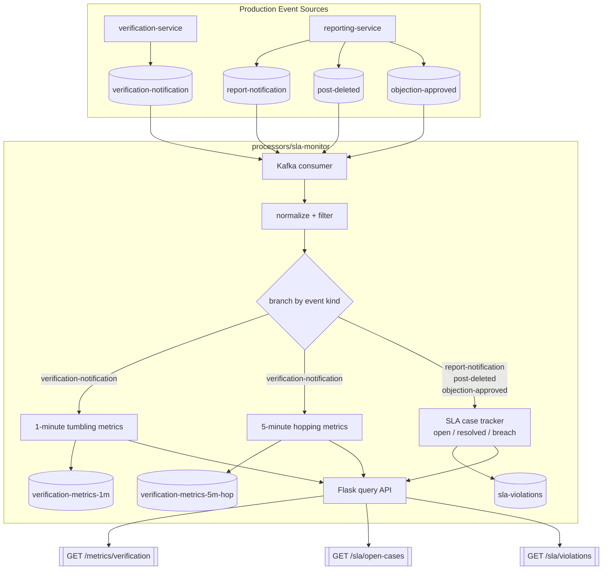

# SLA Monitor Flow

This diagram reflects the repository implementation of `processors/sla-monitor` and the
Kafka-only load-generation workaround used for stream testing.

## Interpretation

- Production path: domain services publish notification/outcome events as part of the normal
  BPMN-driven flows.
- Test path: `scripts/load_sla_monitor.py` bypasses Camunda user-task bottlenecks and writes
  directly to the same Kafka topics.
- Processor path: `sla-monitor` consumes the shared event log, computes windowed verification
  metrics, tracks report SLA state, emits breach alerts, and exposes query endpoints over its
  in-memory materialised state.
