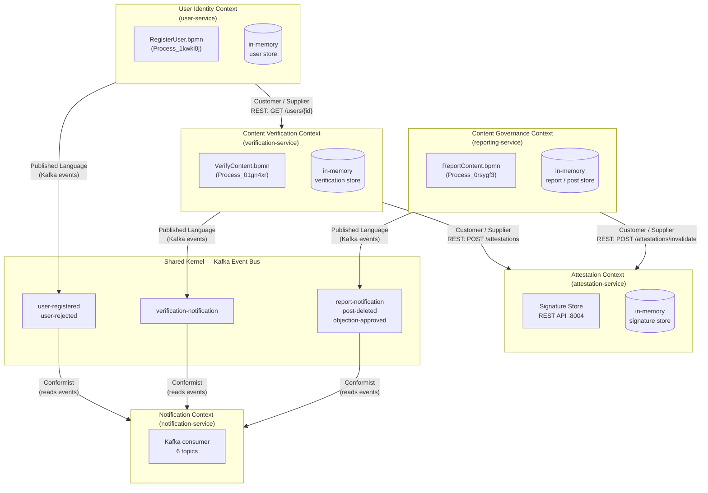
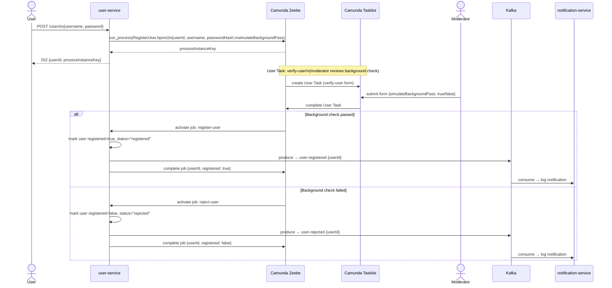
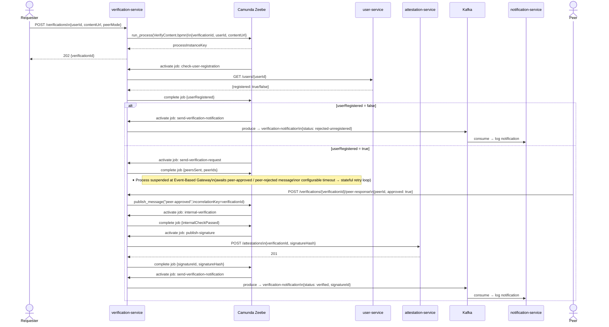
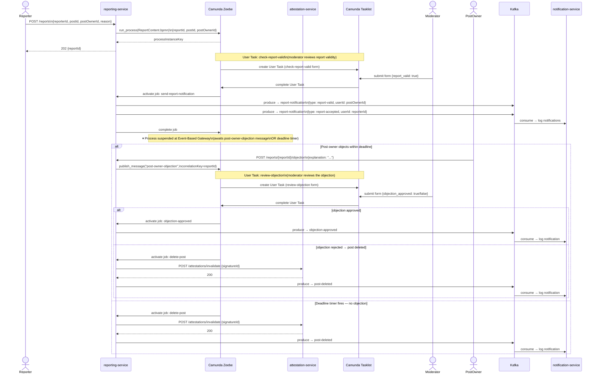
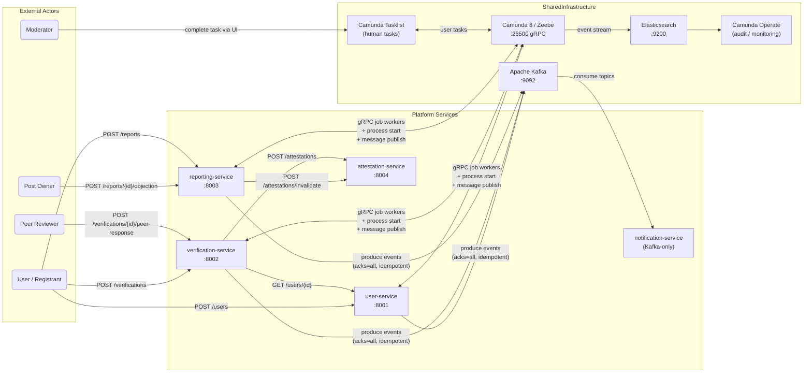
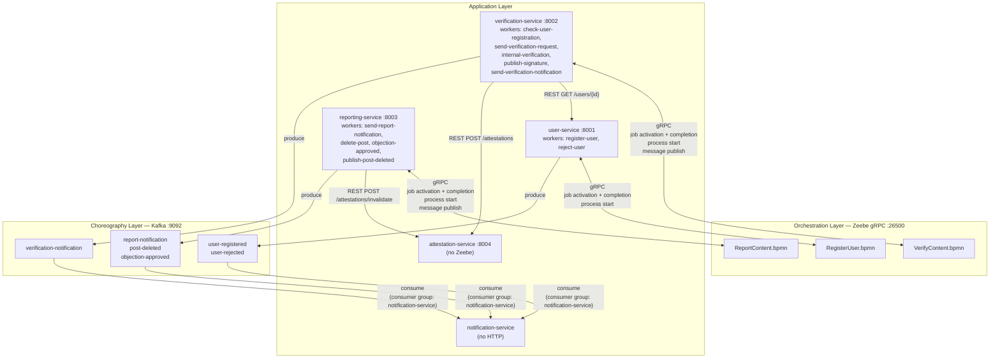

# Submission - Assignment 1

- Course: Event-driven and Process-oriented Architectures (EDPO), FS2026, University of St.Gallen
- Group 4
  - Evan Martino
  - Marco Birchler
  - Roman Babukh

## Repositories

- Project repository: [https://github.com/chechmek/EDPO_FS26_Project](https://github.com/chechmek/EDPO_FS26_Project)
- Exercise 1 repository: [https://github.com/MrStarco/EDPO_FS26_E1_Kafka_Tests](https://github.com/MrStarco/EDPO_FS26_E1_Kafka_Tests)

---

## 1. General Project Description

### 1.1 Project Purpose and Value Proposition

The project is a peer-based content verification platform implemented as a set of Python microservices. Trustworthiness is established through an explicit, auditable process in which a registered user submits content, peers review it, the platform performs additional internal checks, and a cryptographic attestation is created only if the full process reaches a positive outcome. By modelling flows explicitly, the platform can explain why a user was accepted, why content was verified, why a post was deleted, or why an objection was rejected. This information becomes available as part of the attestation signature itself.

### 1.2 Domain Structure and Bounded Contexts

The system is organised into distinct bounded contexts: the user domain is responsible for onboarding and registration status, the verification domain is responsible for peer-based trust decisions, the reporting domain governs moderation and deletion, the attestation domain stores and maintains signatures, and the notification domain notifies users.

The context map below shows how these domains relate to each other. `User Identity` is upstream of `Content Verification`, because verification depends on registration status. `Attestation` is a reusable capability consumed by both verification and governance. Kafka acts as a shared event bus for notification-style communication, and the `notification-service` behaves as a conformist consumer of the published event language.

### 1.3 RegisterUser Process

`RegisterUser.bpmn` (`Process_1kwkl0j`) manages user onboarding (see Appendix D for the visual BPMN representation). A registration request is not automatically accepted, because the platform assumes that participation in later trust-related processes should itself be controlled. The flow therefore includes a human-reviewed background check in Camunda Tasklist before the user account is activated. Only after this decision does the service publish either a `user-registered` or a `user-rejected` event to Kafka. This step is also checked in other processes.

The process begins synchronously through the REST API, becomes stateful inside Zeebe, involves a human task, and only then emits an event for downstream consumers.

From a technical perspective, this demonstrates the overall style of the platform. The `user-service` exposes the external API, starts the BPMN process, executes the service tasks through a Zeebe worker, and persists its domain-facing state in an in-memory store. The generated `userId` then becomes the stable identifier used by the verification flow.

### 1.4 VerifyContent Process

`VerifyContent.bpmn` (`Process_01gn4xr`) governs the full content verification lifecycle and is the central process of the platform (see Appendix D for the visual BPMN representation). After a registered user submits content to be verified, the platform checks eligibility, dispatches peer review requests, waits for peer verdicts through message correlation, performs an internal verification step, and, if the outcome is positive, stores a cryptographic signature through the `attestation-service`.

This process again combines several EDPO concepts: synchronous REST to validate a dependency on the `user-service`, asynchronous waiting via an Event-Based Gateway, stateful retry when peer responses are delayed, internal worker-driven service tasks, a REST-based infrastructure call to the `attestation-service`, and Kafka publication of the final result.

Technically, the `verification-service` is the most orchestration-heavy service in the system. It combines API handling, Zeebe process starts, worker execution, HTTP calls to other services, and Kafka publishing. Its central process variable `verificationId` is a client-visible identifier and the correlation key for Zeebe messages, which keeps the API contract and the workflow state aligned. The process also demonstrates why the platform uses Camunda 8 rather than plain event choreography: peer review is long-running, externally driven, and failure-sensitive, so the system benefits from an explicit process state.

### 1.5 ReportContent Process

`ReportContent.bpmn` (`Process_0rsygf3`) covers the moderation and governance dimension of the platform (see Appendix D for the visual BPMN representation). A reporter can flag a post as problematic, and the process begins with moderator validation, informs the affected post owner, opens a formal objection window, and handles the outcome depending on whether an objection is filed and how it is reviewed. This process gives the platform a procedural fairness which is explainable and contestable.

The flow combines human judgement, time-based waiting, asynchronous callbacks, and compensating action on related infrastructure state. If the post is ultimately invalidated, the attestation signature is updated through the `attestation-service`.

In technical terms, the `reporting-service` demonstrates the strongest human-in-the-loop characteristics of the platform. It starts the process, participates as Zeebe worker, correlates external objection messages back into the workflow, calls the `attestation-service` for signature invalidation, and publishes all externally visible outcomes to Kafka.

### 1.6 Technical Architecture and Runtime Setup

The entire stack is orchestrated using docker-compose. From a communication perspective, the project combines three integration styles. First, HTTP/REST is used for user-facing APIs and for selected synchronous service-to-service checks, such as `verification-service` calling `user-service` or either domain service calling `attestation-service`. Second, Zeebe gRPC is used for process starts, job activation, job completion, and message publication. Third, Kafka is used for notification-style events that should remain decoupled from the success of the core flow.

The five services are implemented in Python 3.12 with Flask. The three orchestrated services connect to Zeebe through `pyzeebe`, an asyncio-native Python library that supports process execution and job-worker behaviour. Each of them runs a Zeebe worker in a dedicated background loop and exposes an HTTP API for starting or interacting with process instances. The `attestation-service` is deliberately simpler: it is a REST-only service that stores and invalidates signatures. The `notification-service` has the opposite profile: it exposes no HTTP interface at all and exists purely as a Kafka consumer that simulates user-facing notifications through log output.

At the current project scale, all service-local state is stored in memory. A service restart clears local read-side state, while the authoritative workflow state remains in Zeebe. For the scope of this project we found this to be acceptable. 

---

## 2. Concepts from the Lecture and Exercises

### 2.1 Event-Driven Architecture and Streaming

We use Kafka only for notification-style side effects, where loose coupling and replayability matter more than end-to-end control. `user-service`, `verification-service`, and `reporting-service` publish events (`user-registered`, `verification-notification`, `report-notification`, `post-deleted`, `objection-approved`); `notification-service` consumes them independently. [ADR-0005](https://github.com/chechmek/EDPO_FS26_Project/blob/main/docs/adr/0005-record-message-broker-selection.md) covers why we chose Kafka over a traditional MQ: retained logs and independent consumer groups fit better than broker-managed push.

`notification-service` uses a named consumer group with manual offset commits, keeping recovery under application control. Producers use `acks=all` and idempotence, which is a small latency cost for reliability under retries.

We deliberately didn;t create the core verification and moderation logic as topic subscriptions — that would scatter control flow and error handling across services.

### 2.2 Process-Oriented Architecture and Orchestration

User onboarding, content verification, and reporting all involve explicit waits, branching, deadlines, and outcomes with legal or reputational weight. These need a process owner. `RegisterUser.bpmn`, `VerifyContent.bpmn`, and `ReportContent.bpmn` run as first-class BPMN processes on Camunda 8 (Zeebe), not as implicit event-handler chains.

[ADR-0001](https://github.com/chechmek/EDPO_FS26_Project/blob/main/docs/adr/0001-record-coordination-pattern.md) captures the split: orchestration for stateful, conditional, auditable flows; choreography for notifications and non-blocking side effects. Domain logic stays in the services, whiule the engine only coordinates the steps.

The BPMN models use service tasks with explicit worker types, user tasks with forms, event-based and exclusive gateways, timer events, and message catch events. [ADR-0002](https://github.com/chechmek/EDPO_FS26_Project/blob/main/docs/adr/0002-record-workflow-engine-selection.md) explains Camunda 8 over 7: our codebase is Python, and `pyzeebe` gave us a clean native integration.

### 2.3 Stateful Resilience and Human Intervention

`VerifyContent.bpmn` and `ReportContent.bpmn` are long-running and depend on state surviving crashes, redeploys, and delayed external input. Instead of writing checkpointing logic, we rely on Zeebe's event-sourced execution: the engine persists process state as an append-only log and reconstructs from snapshots ([ADR-0003](https://github.com/chechmek/EDPO_FS26_Project/blob/main/docs/adr/0003-record-stateful-resilience-error-handling.md)).

The retry counter `send_verify_retry` is a process variable, not an in-memory worker variable, so timeouts and retry budgets stay correct even if a worker dies mid-wait. This is the difference between worker-local retries and workflow-managed retries.

Some failures shouldn't trigger blind automation. The reporting flow pauses at `check-report-valid` and `review-objection`, and registration uses `verify-user` as a human gate.

### 2.4 Sagas, Eventual Consistency, and Async Correlation

Each service owns its state; cross-service coordination happens through orchestration and messaging ([ADR-0004](https://github.com/chechmek/EDPO_FS26_Project/blob/main/docs/adr/0004-record-distributed-data-consistency.md)). `VerifyContent` is an orchestrated saga — user registration is checked synchronously via `user-service`, attestation is delegated to `attestation-service`, and failure paths are handled explicitly.

Local views can diverge temporarily: an attestation can be stored while a service's cache hasn't caught up, or a restarted service can lose its read cache while the process state in Zeebe is fine. The cost of eventual consistency is explicit workflow state management; the benefit is responsiveness and service autonomy.

Async message correlation ([ADR-0007](https://github.com/chechmek/EDPO_FS26_Project/blob/main/docs/adr/0007-record-asynchronous-message-correlation.md)): instead of polling for peer verdicts or objections, workflows suspend at message catch events and resume when the relevant REST endpoint publishes a correlated Zeebe message. `verificationId` and `reportId` are both API identifiers and workflow correlation keys.

REST when a task needs an immediate answer to advance; async messaging when the process can wait or a side effect shouldn't block completion.

### 2.6 CQRS and Auditability

The platform makes decisions that need to be explainable later: users get rejected, content gets certified, reports lead to deletion, late objections get ignored. Camunda Operate and Elasticsearch act as a CQRS-style read side: Zeebe emits the process event stream, Operate projects it into a queryable model, Tasklist handles human tasks. The cost is operational weight; the benefit is no bespoke audit DB and much stronger diagnostics than logs alone.

---

## 3. Results and Insights

### 3.1 Kafka

`acks=all` in a single-broker dev setup is effectively `acks=1` but keeps the code production-ready. With `enable.idempotence=True`, no notification is lost or duplicated under retries.

Manual offset commits in `notification-service` mattered during testing. With auto-commit, a crash between receiving and processing a message silently drops it — the offset has already moved. Committing after the handler gives at-least-once processing.

Kafka UI at `localhost:8079` was used constantly for inspecting payloads, verifying topics, and checking consumer lag — much harder with a traditional queue.

### 3.2 Camunda and Zeebe

One of the more counterintuitive lessons from working with Zeebe was the behaviour of in-memory service state after a restart. The `_verifications` and `_reports` dictionaries in the application services are populated when a process is started via the REST API. If a service container restarts, those dictionaries are empty and any subsequent `GET` request for a running verification or report returns 404, even though the process instance is still alive in Zeebe. This is an accepted limitation at the current project scale and is documented in [ADR-0003](https://github.com/chechmek/EDPO_FS26_Project/blob/main/docs/adr/0003-record-stateful-resilience-error-handling.md), but it was initially surprising and underscores the importance of treating Zeebe as the authoritative state store rather than application-tier memory.

Zeebe's job activation timeout gave us implicit crash recovery. When a container restarted mid-job, Zeebe waited out the timeout and re-offered the job.

Message TTL for late peer verdicts: if a verdict arrives after the verification has timed out, the Zeebe message finds no active subscription and is silently dropped. That's "correct" behaviour, and the REST endpoint returns no error. Giving late peers explicit feedback would need an app-layer state check before publishing.

### 3.3 Impact of Service Unavailability

If `notification-service` is down, all six orchestrated flows continue. Kafka retains events on disk; on restart, the service reads from its last committed offset and catches up.

If a ZeebeWorker service crashes mid-job, Zeebe's activation timeout returns the job to the queue and a restarted worker picks it up. Invisible to the process instance.

If Zeebe itself goes down, all progress is halted — this is an acknowledged downside of a single-broker setup. A production setup would need a multi-broker, multi-partition Zeebe cluster.

---

## 4. Reflections and Lessons Learned

The biggest takeaway was that BPMN makes business logic explicit in a way code doesn't. Every timeout, retry boundary, conditional branch, and human decision is readable directly in the model. When a process misbehaved, opening it in Operate and reading its variable history was easier than grepping logs.

`pyzeebe` made Zeebe genuinely usable from Python — a worker is an `async def` with a `@worker.task(task_type="...")` decorator; gRPC, event loop, and reconnection are all abstracted. The python services themselves were trivial to implement, and were roughly 100 lines each.

In-memory state was fine at course scale but wouldn't fly in production. Each service would need persistent storage so `GET` responses stay consistent with Zeebe. The databases already thhave a place architecturally — they would just need to be wired in. 

At-least-once delivery requires every worker to be idempotent. For each handler we had to ask whether running it twice leaves the system consistent. In practice that meant cheap side-effect-free checks before mutations, and keeping `attestation-service` calls and Kafka produces safe to repeat.

---

## 5. GitHub Release

Assignment-1 release (project / E2-E5): [https://github.com/chechmek/EDPO_FS26_Project/releases/tag/assignment-1](https://github.com/chechmek/EDPO_FS26_Project/releases/tag/assignment-1)

Further information provided in the repository [README.md](https://github.com/chechmek/EDPO_FS26_Project/blob/main/README.md).

Assignment-1 release (Kafka-Tests / E1): [https://github.com/MrStarco/EDPO_FS26_E1_Kafka_Tests/releases/tag/assignment-1](https://github.com/MrStarco/EDPO_FS26_E1_Kafka_Tests/releases/tag/assignment-1)

Further information provided in the repository [README.md](https://github.com/MrStarco/EDPO_FS26_E1_Kafka_Tests/blob/main/README.md).

---

## Appendix

The following documents are attached to this submission PDF as appendices. They are maintained as separate files in the repository and are included here without modification.

**Appendix A — Submission files:**

**Submission — Exercise 1: Kafka Getting Started V2**  
Combined test results from all three team branches covering producer experiments (batch size and latency, acknowledgment configuration, partition scaling, and parallel load), consumer experiments (processing delay and offset misconfiguration), and broker fault-tolerance with leader election.

*Changes in this version:* Based on the feedback received, the report was restructured to follow the topic order given in the exercise description. Additional diagrams were added to illustrate key results.

File: [submission-exercise-1.md](https://github.com/chechmek/EDPO_FS26_Project/blob/main/docs/exercises-submissions/submission-exercise-1.md)

**Submission — Exercise 2: Event Notification Pattern**  
Report on the Event Notification EDA pattern implementation using a social media simulation. Covers the decoupled Kafka-based flow between three microservices (post-service, interaction-service, notification-service), the EDA design rationale, architecture, and verification instructions.  
File: [submission-exercise-2.md](https://github.com/chechmek/EDPO_FS26_Project/blob/main/docs/exercises-submissions/submission-exercise-2.md)

**Submission — Exercise 3: BPMN Orchestration and Process Design**  
Report on the pivot to a content verification platform and the design of three orchestrated BPMN processes (VerifyContent, RegisterUser, ReportContent) executed by Python/Flask microservices via Camunda Zeebe, including the standalone Attestation Service.  
File: [submission-exercise-3.md](https://github.com/chechmek/EDPO_FS26_Project/blob/main/docs/exercises-submissions/submission-exercise-3.md)

**Submission — Exercise 4: Orchestration vs. Choreography and ADR**  
Report on the coordination pattern decision (hybrid orchestration with Zeebe and choreography via Kafka) and the ADR justifying Camunda 8 over Camunda 7 for Python-based microservices.  
File: [submission-exercise-4.md](https://github.com/chechmek/EDPO_FS26_Project/blob/main/docs/exercises-submissions/submission-exercise-4.md)

**Submission — Exercise 5: Stateful Resilience Patterns**  
Detailed report on the implementation of Stateful Retry and Human Intervention in the BPMN processes, including process-level design rationale and lecture references.  
File: [submission-exercise-5.md](https://github.com/chechmek/EDPO_FS26_Project/blob/main/docs/exercises-submissions/submission-exercise-5.md)

**Appendix B — Team Responsibilities**
Full exercise-by-exercise responsibility table with links to the repository and commit history.
File: [submission-responsibilities.md](https://github.com/chechmek/EDPO_FS26_Project/blob/main/docs/exercises-submissions/submission-responsibilities.md)

**Appendix C — Architecture Diagrams**
Complete set of six conceptual diagrams: System Context, DDD Context Map, Service Architecture, and three end-to-end sequence diagrams (RegisterUser, VerifyContent, ReportContent).
File: [submission-diagrams.md](https://github.com/chechmek/EDPO_FS26_Project/blob/main/docs/exercises-submissions/submission-diagrams.md)

**Appendix D — BPMN Models and Forms**
The complete executable process models and their associated Camunda forms used in the project. These files document the workflow logic directly at the modelling level and complement the textual and diagrammatic explanations in the main submission.

File: [submission-bpmn-files.md](https://github.com/chechmek/EDPO_FS26_Project/blob/main/docs/exercises-submissions/submission-bpmn-files.md)

**Appendix E — Architecture Decision Records**
Full text of all eight ADRs covering coordination pattern, workflow engine selection, stateful resilience, distributed data consistency, message broker selection, process model boundaries, asynchronous message correlation, and auditing.

| ADR                                                                                                                            | Title                                                                         | Main Contribution to the Architecture                                                            | Key Trade-off                                                                                         |
| ------------------------------------------------------------------------------------------------------------------------------ | ----------------------------------------------------------------------------- | ------------------------------------------------------------------------------------------------ | ----------------------------------------------------------------------------------------------------- |
| [ADR-0001](https://github.com/chechmek/EDPO_FS26_Project/blob/main/docs/adr/0001-record-coordination-pattern.md)               | Coordination Pattern: Hybrid Orchestration and Choreography                   | Establishes the hybrid model of Zeebe orchestration plus Kafka choreography                      | Better visibility and control for core flows at the cost of a larger operational surface              |
| [ADR-0002](https://github.com/chechmek/EDPO_FS26_Project/blob/main/docs/adr/0002-record-workflow-engine-selection.md)          | Workflow Engine Selection: Camunda 8 over Camunda 7                           | Chooses Camunda 8 because Python services can use `pyzeebe` and benefit from event-sourced state | Stronger workflow support and crash resilience at the cost of Java-based infrastructure               |
| [ADR-0003](https://github.com/chechmek/EDPO_FS26_Project/blob/main/docs/adr/0003-record-stateful-resilience-error-handling.md) | Stateful Resilience and Error Handling                                        | Puts retries and crash recovery into Zeebe and routes irreversible cases to human tasks          | Simpler services and clearer recovery paths, but a hard dependency on Zeebe and Tasklist              |
| [ADR-0004](https://github.com/chechmek/EDPO_FS26_Project/blob/main/docs/adr/0004-record-distributed-data-consistency.md)       | Distributed Data Consistency: Saga Pattern over Distributed ACID Transactions | Enforces database-per-service and saga-style coordination instead of distributed transactions    | Independent services and scalable coordination, but temporary inconsistency and explicit compensation |
| [ADR-0005](https://github.com/chechmek/EDPO_FS26_Project/blob/main/docs/adr/0005-record-message-broker-selection.md)           | Message Broker Selection: Apache Kafka for Choreography Events                | Picks Kafka for retained, replayable, multi-consumer notification streams                        | More extensibility and durability, but more operational complexity than a simple queue                |
| [ADR-0006](https://github.com/chechmek/EDPO_FS26_Project/blob/main/docs/adr/0006-record-process-model-boundaries.md)           | Process Model Boundaries: One BPMN Model per Bounded Context                  | Prevents a process monolith by aligning one BPMN model with one bounded context                  | Better ownership and isolation, but cross-context queries require aggregation                         |
| [ADR-0007](https://github.com/chechmek/EDPO_FS26_Project/blob/main/docs/adr/0007-record-asynchronous-message-correlation.md)   | Asynchronous Message Correlation via Zeebe                                    | Uses native Zeebe message correlation for peer verdicts and objections                           | No polling and no routing tables, but late messages may be discarded after TTL                        |

