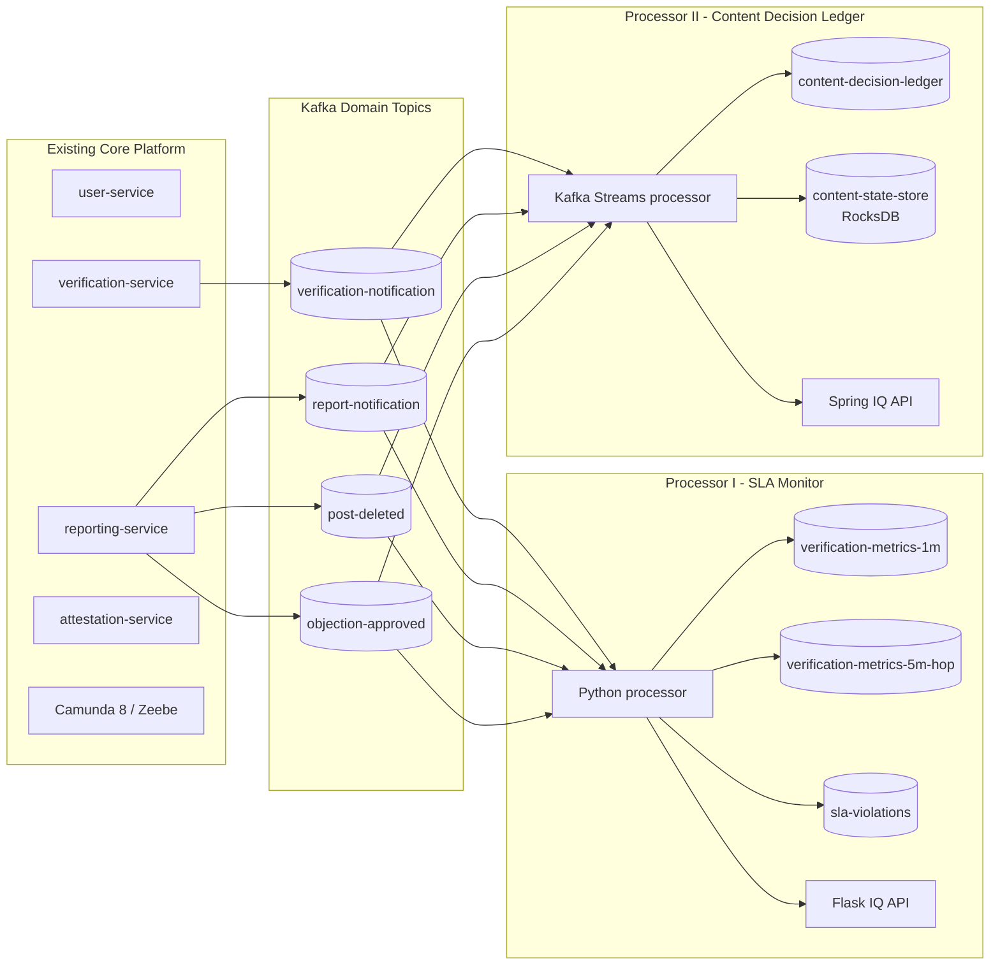
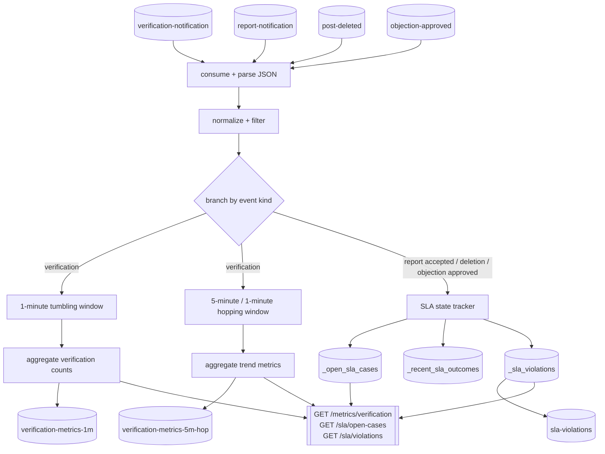
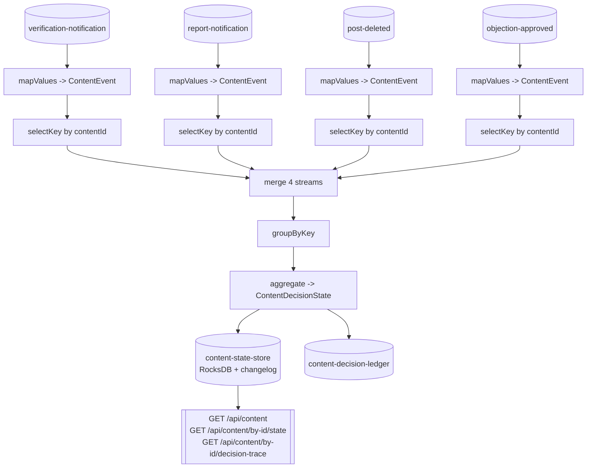

# Submission - Assignment 2

- Course: Event-driven and Process-oriented Architectures (EDPO), FS2026, University of St.Gallen
- Group 4
  - Evan Martino
  - Marco Birchler
  - Roman Babukh

## Repository

- Project repository: [https://github.com/chechmek/EDPO_FS26_Project](https://github.com/chechmek/EDPO_FS26_Project)

---

## 1. General Description of the Project

Our software project is a peer-based content verification platform. A user first registers through a moderated onboarding process, then submits content for verification, after which peers review the submission and the platform performs additional internal checks. If the outcome is positive, the system creates a cryptographic attestation. Reported content can later enter a moderation process with human review and an objection window.

The first assignment established the platform as a hybrid EDPO architecture with bounded contexts, BPMN orchestration in Camunda 8, and asynchronous choreography via Kafka. Assignment 2 extends this architecture with a dedicated stream-processing layer that consumes the existing Kafka event bus without changing the upstream BPMN processes or service APIs. This allowed us to add read-side views, operational monitoring, and audit-oriented projections while preserving the decoupled event-driven style of the original system.

The stream-processing layer consists of two independent processors:

1. `processors/sla-monitor`: a Python processor that computes windowed verification metrics and tracks moderation SLA breaches.
2. `processors/content-ledger`: a Java / Kafka Streams processor that materializes the lifecycle of each content item into a queryable decision ledger.

Both processors consume the same four domain topics:

- `verification-notification`
- `report-notification`
- `post-deleted`
- `objection-approved`

They then derive specialized read models and monitoring outputs for different purposes.

### 1.1 Processing-Layer Overview

## 2. Explicit References to Lecture and Exercise Concepts

Assignment 2 covers the task-sheet suggestions directly and also links back to broader EDPO concepts from Assignment 1.

### 2.1 Assignment-2 Stream-Processing Concepts

| Concept from class / task sheet         | Where it appears in our project                                                                              |
| --------------------------------------- | ------------------------------------------------------------------------------------------------------------ |
| Several stateless operations (Week 8)   | `normalize`, `filter`, `branch`, `mapValues`, `selectKey` in both processors                                 |
| Streams and tables together (Week 9)    | `content-ledger` aggregates multiple `KStream`s into a materialized `KTable`                                 |
| Data from more than one stream (Week 9) | both processors consume four input topics                                                                    |
| Interactive Queries (Week 9)            | Flask endpoints in `sla-monitor`, Spring REST endpoints in `content-ledger`                                  |
| Windowed operations (Week 10)           | 1-minute tumbling and 5-minute/1-minute hopping windows in `sla-monitor`                                     |
| Event-time processing (Week 10)         | both processors use `eventTime` from the payload rather than consumer wall-clock time                        |
| Out-of-order handling (Week 10)         | late moderation outcomes buffered in `sla-monitor`; decision traces sorted by event time in `content-ledger` |

### 2.2 Broader EDPO Concepts Covered Across the Whole Project

| EDPO concept                              | How it is realized                                                                                         |
| ----------------------------------------- | ---------------------------------------------------------------------------------------------------------- |
| Bounded contexts / domain decomposition   | `user-service`, `verification-service`, `reporting-service`, `attestation-service`, `notification-service` |
| Process orchestration                     | Camunda 8 BPMN processes `RegisterUser`, `VerifyContent`, `ReportContent`                                  |
| Event choreography                        | Kafka notification and outcome topics exchanged between services and processors                            |
| Human intervention                        | moderator tasks in registration and moderation flows                                                       |
| Stateful resilience                       | retry and wait states in BPMN from Assignment 1; materialized state in stream processors in Assignment 2   |
| CQRS-style read side                      | both processors build read models that are separate from the write-side services                           |
| Event sourcing / replay-oriented thinking | log-compacted ledger topic and deterministic event-time processing                                         |
| Eventual consistency                      | processors derive state asynchronously from Kafka rather than updating a shared database synchronously     |

## 3. Stream Processing App 1 - SLA Monitor

### 3.1 Goal

The SLA Monitor provides real-time observability over the verification process and moderation pipeline. It answers two practical questions:

1. What verification outcomes are currently occurring, and at what rate?
2. Are accepted moderation cases resolved within the target SLA window?

This processor therefore supports both operational monitoring and policy enforcement.

### 3.2 Topology Graph

### 3.3 Detailed Description and Justification

The processor is intentionally split into two logical sub-topologies.

The first sub-topology handles verification metrics. Incoming `verification-notification` events are normalized, filtered, and counted by outcome. We use a 1-minute tumbling window for short-lived operational snapshots and a 5-minute hopping window with 1-minute advance for smoother trend analysis. This combination mirrors the lecture discussion of windowing trade-offs: tumbling windows give clean per-interval summaries, while hopping windows provide overlap that better captures trends.

The second sub-topology handles moderation SLA tracking. A `report-notification` event with `status=report-accepted` opens an SLA case keyed by `contentId`. A `post-deleted` or `objection-approved` event closes the case. If no closing outcome arrives before the deadline, the processor emits a `sla-violations` event. Because the Python implementation uses `confluent-kafka` rather than the Kafka Streams DSL, the correlation is implemented as a manual stateful join with in-memory structures instead of a declarative KStream-KStream join. This was a deliberate trade-off: it let us build the processor quickly in a language already used by the rest of the platform, at the cost of manually implementing state handling, late-event buffering, and breach scanning logic.

The Python implementation follows the same conceptual model as Kafka Streams, implemented manually rather than through a DSL. Each incoming event is first normalized by a dedicated `_normalize_*` function which is the equivalent of a stateless `mapValues` step. The `_process_event` function then routes events to either the windowed metric aggregation or the SLA correlation path, acting as a branch operator. Windowed state is held in plain Python dictionaries keyed by time bucket, which fulfils the same role as a Kafka Streams tumbling or hopping window aggregate. SLA tracking state (`_open_sla_cases`, `_recent_sla_outcomes`, `_sla_violations`) acts as a keyed in-memory state store, and the Flask endpoints expose it as interactive queries.

### 3.4 Lecture Concepts Realized

| Concept                                 | How it appears                                               |
| --------------------------------------- | ------------------------------------------------------------ |
| Single-Event Processing                 | normalize and filter each message before routing             |
| Branch pattern                          | split verification events from moderation outcome events     |
| Re-keying / repartitioning conceptually | correlation is done by `contentId`                           |
| Stream-stream join conceptually         | accepted reports are matched with later outcomes             |
| Local materialized state                | `_open_sla_cases`, `_recent_sla_outcomes`, `_sla_violations` |
| Interactive Queries                     | Flask endpoints expose current in-memory state               |
| Tumbling window                         | 1-minute verification aggregates                             |
| Hopping window                          | 5-minute windows advanced every minute                       |
| Event time                              | `eventTime` is used for window placement and SLA age         |
| Grace / late events                     | outcomes can arrive late or before the start event           |

---

## 4. Stream Processing App 2 - Content Decision Ledger

### 4.1 Goal

The Content Decision Ledger builds a queryable per-content audit trail. Every event that affects a content item is folded into a single `ContentDecisionState` so that the current lifecycle state and the chronological decision trace can be retrieved with low latency.

This processor is the read-side projection that most directly supports explainability and auditability.

### 4.2 Topology Graph

### 4.3 Detailed Description and Justification

The topology first normalizes four heterogeneous input streams into a unified `ContentEvent` model. This is a Week-8 style stateless mapping step that reduces downstream complexity. The processor then re-keys every event by `contentId`, merges the streams, groups by key, and aggregates them into a `ContentDecisionState`.

The aggregation result is materialized as a `KTable` backed by RocksDB and a Kafka changelog. This directly uses the KStream/KTable duality covered in class: the incoming event streams are the append-only fact log, while the table is the latest derived state per content item. The same state is also emitted to the log-compacted topic `content-decision-ledger`, which makes the read model replayable and durable.

The aggregator is deliberately idempotent. Every event carries or derives an `eventId`, and duplicates are skipped via `seenEventIds`. We also sort the decision trace by `eventTime` on insertion so that reprocessing and late arrivals remain deterministic. This matters because audit-style read models lose credibility quickly if duplicates or out-of-order artifacts appear in the visible history.

In this project, "content" is only conceptual (business logic), there is no content service, no content store, and no content object. `contentId` is a stable correlation key, not a user-facing entity. Content exists only as a `contentUrl` reference passed to the `verification-service`, which is the only thing the platform acts on. The `verification-service` derives `contentId` deterministically from that URL using a SHA-256 hash prefix (`content-{sha256[:16]}`). The `reporting-service` uses `postId` as the correlation key when publishing moderation events; to have a report and its corresponding verification appear as a single ledger entry, the `postId` in the report must match the `contentId` generated during verification.

### 4.4 Lecture Concepts Realized

| Concept                      | How it appears                                        |
| ---------------------------- | ----------------------------------------------------- |
| Stateless `mapValues`        | each topic is normalized independently                |
| `selectKey` / repartitioning | all events for one `contentId` are co-located         |
| Stream merge                 | four streams become one logical event stream          |
| Streams and tables together  | KStream inputs aggregated into a KTable               |
| `groupByKey + aggregate`     | builds the materialized lifecycle projection          |
| State store                  | `content-state-store` in RocksDB                      |
| Interactive Queries          | Spring REST layer reads the local Kafka Streams store |
| Reprocessing pattern         | compacted output topic can rebuild state              |

---

## 5. Architectural Decisions and Trade-offs

### 5.1 Python Consumer vs Kafka Streams DSL

We intentionally implemented the two processors differently:

- `sla-monitor` was deliberately built in Python because the SLA tracking logic is inherently a keyed stateful join between `report-accepted` events and their later resolution events. This is a pattern that is straightforward to implement manually in the same language as the upstream services. Using Python eliminated the Java/Spring setup overhead and let us focus on the stream-processing concepts themselves. The cost is that state handling, late-event buffering, and breach scanning had to be written explicitly, with no built-in changelog-backed recovery. Since the processor's state can be fully rebuilt from Kafka replay on restart, we accepted this trade-off.
- `content-ledger` in Kafka Streams DSL required a heavier Java/Spring toolchain, but the aggregation of four heterogeneous streams into a materialized per-key lifecycle state was a better fit for the declarative DSL. Built-in RocksDB persistence, automatic changelog topics, and native Interactive Queries made the read-side projection more robust and required less manual implementation.

This contrast was useful for learning because it made the value of Kafka Streams stateful abstractions concrete rather than theoretical. Building both sides of the same conceptual model (once manually, once declaratively) gave us a direct comparison of the trade-offs.

### 5.2 JSON at Runtime vs Avro on the Wire

The task sheet suggests Avro, and we partially implemented this direction by providing explicit Avro schemas for the ledger under `schemas/content-ledger/`. At runtime, however, we kept JSON because the upstream Python services already publish JSON and we wanted to avoid the additional operational complexity of introducing Schema Registry late in the semester.

Concretely, using Avro at runtime would have required running a Confluent Schema Registry alongside Kafka, updating all Python producer services to use Avro serializers, and aligning schema compatibility settings across both processors. For a prototype where the upstream event contracts were already stable and well-understood, this overhead was not justified. However, in a production scenario Avro with Schema Registry would be the right choice. It enforces schema compatibility on every publish, prevents silent breaking changes as the event model evolves, and reduces payload size. The Avro schemas under `schemas/content-ledger/` document the intended contract and would be the starting point for that migration.

Our practical conclusion is that JSON was the right short-term choice for the course prototype, while Avro remains the more scalable production direction.

### 5.3 Event Time vs Processing Time

Both processors rely on `eventTime` contained in the payload, not consumer wall-clock time. This decision was essential for replayability, late-event handling, and correct window semantics. The downside is that late and out-of-order events must be handled explicitly, which increased design complexity in both processors.

### 5.4 Event-Driven Read Models vs Shared Database Reads

We deliberately built read-side projections from Kafka rather than querying the services' internal state stores directly. This preserves bounded-context autonomy and avoids coupling the processors to service implementation details. The cost is eventual consistency: the queryable read models update asynchronously and may temporarily lag behind the command side.

---

## 6. Additional Results and Insights

### 6.1 What We Learned from Kafka Streams

The Content Decision Ledger made the main Kafka Streams concepts tangible in our own implementation. Modeling the read side as a Materialized `KTable` backed by RocksDB and a changelog gave us a clear recovery model and allowed the REST endpoints to serve current content state directly. The log-compacted `content-decision-ledger` topic matched the "latest state per key" semantics well, while replaying events helped validate aggregation changes without changing upstream services. We also learned that practical stream processing needs careful handling of duplicates and event ordering: deduplication by event identifier keeps retries from changing the result, and sorting the decision trace by payload event time makes out-of-order arrivals easier to reason about. Interactive Queries worked well for low-latency local reads, but they also showed why key-based routing and awareness of instance-local state matter in distributed deployments.

### 6.2 What We Learned from Combining the Two Processors

Using the same four topics for two separate processors demonstrated a core event-driven benefit: one event log can support multiple independent downstream views. One processor serves observability and alerting, while the other serves auditability and low-latency query access. No upstream BPMN process had to change.

---

## 7. GitHub Release

Assignment-2 release: [https://github.com/chechmek/EDPO_FS26_Project/releases/tag/assignment-2](https://github.com/chechmek/EDPO_FS26_Project/releases/tag/assignment-2)

---

# Further information

Further information provided in the repository:

- [README.md](https://github.com/chechmek/EDPO_FS26_Project/blob/main/README.md) — full setup and platform overview
- [processors/sla-monitor/README.md](https://github.com/chechmek/EDPO_FS26_Project/blob/main/processors/sla-monitor/README.md) — SLA Monitor implementation details, APIs, and load scripts
- [processors/content-ledger/README.md](https://github.com/chechmek/EDPO_FS26_Project/blob/main/processors/content-ledger/README.md) — Content Decision Ledger implementation details, APIs, and demo script

---

## Appendix

The following documents are attached to this submission as appendices. They are maintained as separate files in the repository and are included here without modification.

**Appendix F — Team Responsibilities**
Full exercise-by-exercise responsibility table with links to the repository and commit history.
File: [submission-responsibilities-assignement-2.md](https://github.com/chechmek/EDPO_FS26_Project/blob/main/docs/exercises-submissions/submission-responsibilities-assignement-2.md)

**Appendix G — Changes Made Compared to Assignment 1 (including link to the final releases of Assignment 1 and 2)**
Detailed description of what was changed between Assignment 1 and Assignment 2, clarifying that no retrospective changes were made to Assignment 1 after its submission. Includes baseline reference to the Assignment 1 GitHub release.
File: [submission-changes-assignment-2.md](https://github.com/chechmek/EDPO_FS26_Project/blob/main/docs/exercises-submissions/submission-changes-assignment-2.md)

**Appendix — Assignment 1 Complete Submission (included in submission zip; including link to the final release of Assignment 1)**
Final version of the Assignment 1 submission report as graded together with Assignment 2. This document is unchanged from its original form; no retrospective edits were made after the Assignment 1 submission deadline.
File: [submission-assignment-1-complete.pdf](https://github.com/chechmek/EDPO_FS26_Project/blob/main/docs/exercises-submissions/submission-assignment-1-complete.pdf)

**Appendix — Assignment 1 Slides (inlcuded in submission zip)**
Final slide deck for Assignment 1.
File: [submission-assignment-1-slides.pdf](https://github.com/chechmek/EDPO_FS26_Project/blob/main/docs/exercises-submissions/submission-assignment-1-slides.pdf)

**Appendix — Assignment 2 Slides (inlcuded in submission zip)**  
Final slide deck for Assignment 2.  
File: [submission-assignment-2-slides.pdf](https://github.com/chechmek/EDPO_FS26_Project/blob/main/docs/exercises-submissions/submission-assignment-2-slides.pdf)