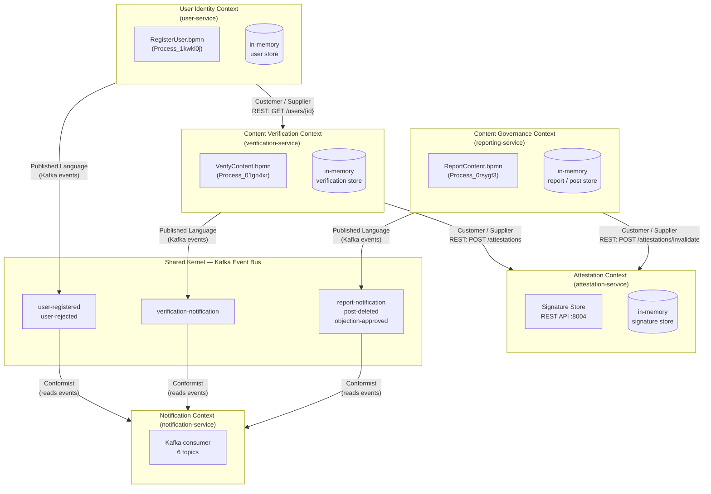
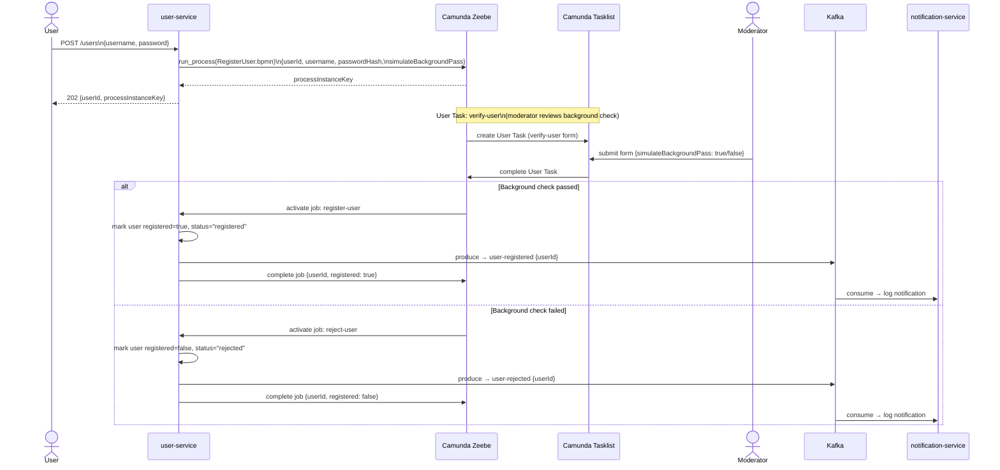
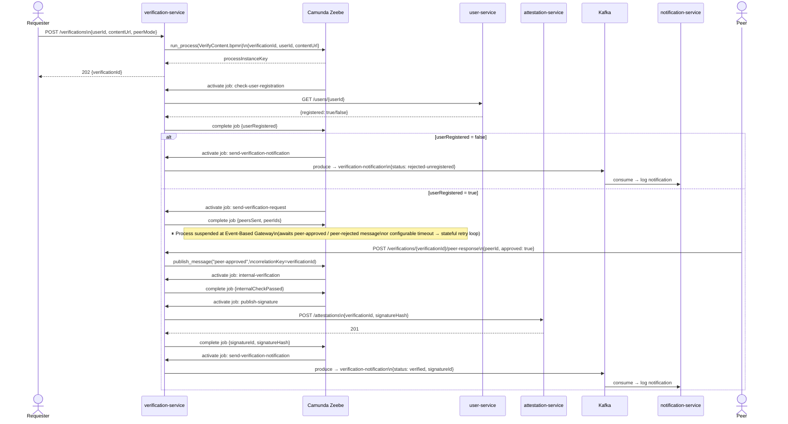
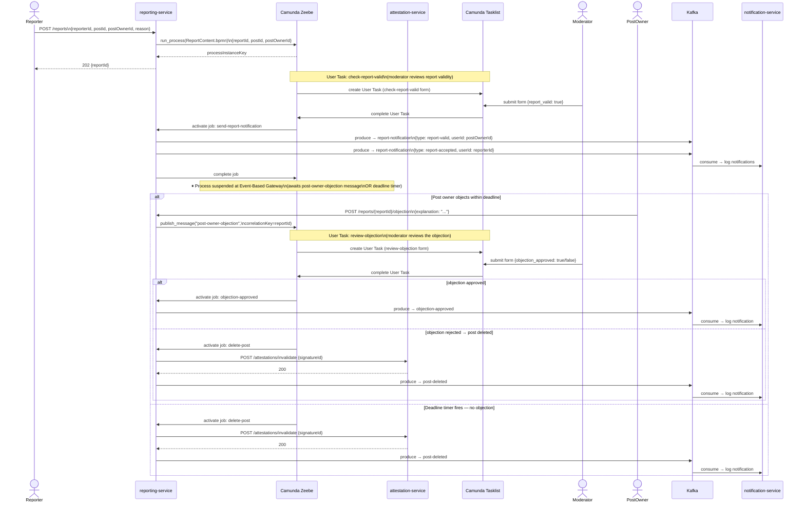
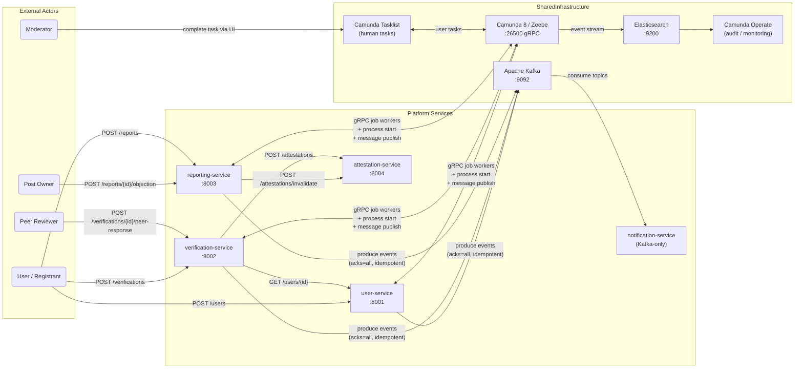
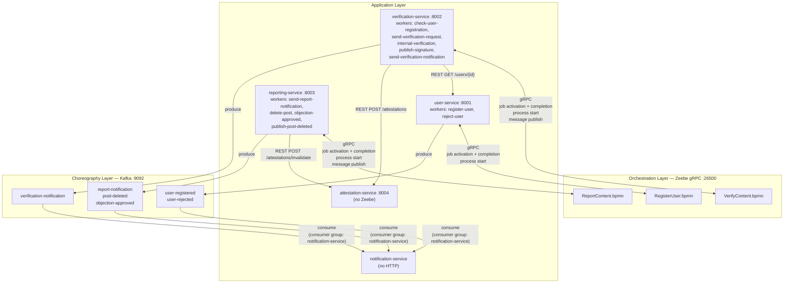

# Submission - Assignment 1

- Course: Event-driven and Process-oriented Architectures (EDPO), FS2026, University of St.Gallen
- Group 4
  - Evan Martino
  - Marco Birchler
  - Roman Babukh

## Repositories

- Project repository: [https://github.com/chechmek/EDPO_FS26_Project](https://github.com/chechmek/EDPO_FS26_Project)
- Exercise 1 repository: [https://github.com/MrStarco/EDPO_FS26_E1_Kafka_Tests](https://github.com/MrStarco/EDPO_FS26_E1_Kafka_Tests)

---

## 1. General Project Description

### 1.1 Project Purpose and Value Proposition

The project is a peer-based content verification platform implemented as a set of Python microservices. Trustworthiness is established through an explicit, auditable process in which a registered user submits content, peers review it, the platform performs additional internal checks, and a cryptographic attestation is created only if the full process reaches a positive outcome. By modelling flows explicitly, the platform can explain why a user was accepted, why content was verified, why a post was deleted, or why an objection was rejected. This information becomes available as part of the attestation signature itself.

### 1.2 Domain Structure and Bounded Contexts

The system is organised into distinct bounded contexts: the user domain is responsible for onboarding and registration status, the verification domain is responsible for peer-based trust decisions, the reporting domain governs moderation and deletion, the attestation domain stores and maintains signatures, and the notification domain notifies users. This separation allows each part of the platform to retain a clear responsibility while still participating in end-to-end processes.

The context map below shows how these domains relate to each other. `User Identity` is upstream of `Content Verification`, because verification depends on registration status. `Attestation` is a reusable capability consumed by both verification and governance. Kafka acts as a shared event bus for notification-style communication, and the `notification-service` behaves as a conformist consumer of the published event language.

### 1.3 RegisterUser Process

`RegisterUser.bpmn` (`Process_1kwkl0j`) manages user onboarding (see Appendix D for the visual BPMN representation). A registration request is not automatically accepted, because the platform assumes that participation in later trust-related processes should itself be controlled. The flow therefore includes a human-reviewed background check in Camunda Tasklist before the user account is activated. Only after this decision does the service publish either a `user-registered` or a `user-rejected` event to Kafka. This makes onboarding part of the lifecycle of the platform, not just a one-time setup step.

The process begins synchronously through the REST API, becomes stateful inside Zeebe, involves a human task, and only then emits an event for downstream consumers.

From a technical perspective, this demonstrates the overall style of the platform. The `user-service` exposes the external API, starts the BPMN process, executes the service tasks through a Zeebe worker, and persists its domain-facing state in an in-memory store. The generated `userId` then becomes the stable identifier used by the verification flow.

### 1.4 VerifyContent Process

`VerifyContent.bpmn` (`Process_01gn4xr`) governs the full content verification lifecycle and is the central process of the platform (see Appendix D for the visual BPMN representation). After a registered user submits content to be verified, the platform checks eligibility, dispatches peer review requests, waits for peer verdicts through message correlation, performs an internal verification step, and, if the outcome is positive, stores a cryptographic signature through the `attestation-service`. The proposition of the system is that trust is earned through a transparent, multi-step workflow that can later be inspected and explained.

This process combines several EDPO concepts in one flow: synchronous REST to validate a dependency on the `user-service`, asynchronous waiting via an Event-Based Gateway, stateful retry when peer responses are delayed, internal worker-driven service tasks, a REST-based infrastructure call to the `attestation-service`, and Kafka publication of the final result.

Technically, the `verification-service` is the most orchestration-heavy service in the system. It combines API handling, Zeebe process starts, worker execution, HTTP calls to other services, and Kafka publishing. Its central process variable `verificationId` is a client-visible identifier and the correlation key for Zeebe messages, which keeps the API contract and the workflow state aligned. The process also demonstrates why the platform uses Camunda 8 rather than plain event choreography: peer review is long-running, externally driven, and failure-sensitive, so the system benefits from an explicit process state rather than a chain of stateless consumers.

### 1.5 ReportContent Process

`ReportContent.bpmn` (`Process_0rsygf3`) covers the moderation and governance dimension of the platform (see Appendix D for the visual BPMN representation). A reporter can flag a post as problematic, but deletion is not executed as an immediate automated reaction. Instead, the process starts with moderator validation, informs the affected post owner, opens a formal objection window, and handles the outcome depending on whether an objection is filed and how it is reviewed. This process gives the platform a procedural fairness which is explainable and contestable.

The flow is especially important from an architectural point of view because it combines human judgement, time-based waiting, asynchronous callbacks, and compensating action on related infrastructure state. If the post is ultimately deleted, the process also invalidates the attestation signature through the `attestation-service`, which ties governance back to the platform's trust model.

In technical terms, the `reporting-service` demonstrates the strongest human-in-the-loop characteristics of the platform. It starts the process, participates as Zeebe worker, correlates external objection messages back into the workflow, calls the `attestation-service` for signature invalidation, and publishes all externally visible outcomes to Kafka. The process is intentionally designed so that irreversible actions do not happen before the possibility of review and objection has been exhausted.

### 1.6 Technical Architecture and Runtime Setup

The entire stack is containerised with Docker Compose, but the runtime architecture is intentionally split between infrastructure concerns. Camunda 8 Run (`c8run`) operates on the host, exposing Zeebe gRPC on port 26500 and Camunda Operate and Tasklist on port 8080, while the application services and Kafka infrastructure run in containers. This split reflects a practical development trade-off: it keeps the local Zeebe runtime easy to inspect and manage while still allowing the services to be deployed and rebuilt consistently through Docker.

From a communication perspective, the project combines three integration styles. First, HTTP/REST is used for user-facing APIs and for selected synchronous service-to-service checks, such as `verification-service` calling `user-service` or either domain service calling `attestation-service`. Second, Zeebe gRPC is used for process starts, job activation, job completion, and message publication. Third, Kafka is used for notification-style events that should remain decoupled from the success of the core flow. This gives each communication channel a clear semantic role rather than mixing all interactions through a single protocol.

The five services are implemented in Python 3.12 with Flask. The three orchestrated services connect to Zeebe through `pyzeebe`, an asyncio-native Python library that supports process execution and job-worker behaviour. Each of them runs a Zeebe worker in a dedicated background loop and exposes an HTTP API for starting or interacting with process instances. The `attestation-service` is deliberately simpler: it is a REST-only service that stores and invalidates signatures. The `notification-service` has the opposite profile: it exposes no HTTP interface at all and exists purely as a Kafka consumer that simulates user-facing notifications through log output.

At the current project scale, all service-local state is stored in memory, which keeps the implementation lightweight and easy to understand for a course project. That decision also makes some limitations explicit: a service restart clears local read-side state, while the authoritative workflow state remains in Zeebe. For the scope of this project we found this to be acceptable. 

---

## 2. Concepts from the Lecture and Exercises

### 2.1 Event-Driven Architecture and Streaming Fundamentals

 We use Kafka only where the lecture material suggests that loose coupling and replayability are more valuable than end-to-end process control: notification-style side effects. In concrete terms, `user-service`, `verification-service`, and `reporting-service` publish events such as `user-registered`, `verification-notification`, `report-notification`, `post-deleted`, and `objection-approved`, while `notification-service` consumes them independently. This design follows the Event Notification pattern discussed in the early weeks and later justified formally in [ADR-0005](https://github.com/chechmek/EDPO_FS26_Project/blob/main/docs/adr/0005-record-message-broker-selection.md), where Kafka was chosen over a traditional MQ because retained logs and independent consumer groups fit our use case better than broker-managed push delivery.

 Kafka lectures emphasised that offsets, partitions, and consumer groups are what make scalability and fault tolerance possible. Our `notification-service` therefore uses a named consumer group and manual offset commits, so recovery semantics remain under application control instead of being delegated to auto-commit behaviour. Likewise, producer settings such as `acks=all` and idempotence reflect a deliberate trade-off between latency and reliability: each notification incurs slightly more overhead, but the producer is resilient under retries and future replication scenarios. The resulting architecture covers the material from Lecture 1 on topics, partitions, offsets, and consumer groups, while the implementation experience from the early exercises showed us that the broker becomes much more than a transport layer: it also becomes a debugging and observability tool, especially through Kafka UI.

Event-driven decoupling is powerful, but not automatically the right choice for long-running, stateful business flows. Like we said before,we use Kafka where replayable, fan-out style side effects are desirable, but, we avoid encoding the core verification and moderation logic as a chain of opaque topic subscriptions because that would distribute control flow and error handling across multiple services.

### 2.2 Process-Oriented Architecture, Orchestration, and Workflow Ownership

From Lecture 3 onward, the course moved from event streams to process automation and asked when choreography stops being sufficient. User onboarding, content verification, and reporting all involve explicit waits, branching decisions, deadlines, and legally or reputationally significant outcomes. In the lecture's terms, these are precisely the situations in which a process owner should exist. Our system therefore models `RegisterUser.bpmn`, `VerifyContent.bpmn`, and `ReportContent.bpmn` as first-class BPMN processes executed on Camunda 8 (Zeebe), rather than leaving the end-to-end lifecycle implicit across a set of event handlers.

This design directly reflects the argument developed in the orchestration lectures: choreography maximises decoupling and should be the default for distributed systems, but it loses visibility when the workflow itself becomes a business asset. The project therefore adopts the hybrid coordination strategy documented in [ADR-0001](https://github.com/chechmek/EDPO_FS26_Project/blob/main/docs/adr/0001-record-coordination-pattern.md): orchestration for stateful, conditional, auditable business flows; choreography for notifications and other non-blocking side effects. Domain logic remains in the services; the engine coordinates steps, deadlines, and state transitions. This distinction mirrors the lecture's warning that orchestration does not create poor architecture by itself; poor service boundaries do.

The following system-context diagram should therefore be read not as an isolated illustration, but as a condensed architectural argument. It shows that the user-facing and peer-facing interactions enter the system through domain services, while Zeebe, Kafka, Tasklist, and Operate each support a distinct coordination or observability concern.

The BPMN implementation itself covers a broad set of process concepts from the middle part of the course: service tasks with explicit worker types, user tasks with forms, event-based gateways, exclusive gateways, timer events, message catch events, and process-level ownership. In implementation terms, this is where [ADR-0002](https://github.com/chechmek/EDPO_FS26_Project/blob/main/docs/adr/0002-record-workflow-engine-selection.md) becomes relevant. Camunda 8 was chosen over Camunda 7 because the project is written in Python and `pyzeebe` provides a clean, native integration path. The decision was therefore not only architectural but socio-technical: it aligned the process engine with the team's language, deployment model, and operational capabilities.

### 2.3 Service Boundaries, Bounded Contexts, and the Avoidance of a Process Monolith

One of the recurring ideas in both the lectures and the later exercises is that process automation only remains maintainable if the boundaries of the automated process align with meaningful domain boundaries. We therefore did not model one giant BPMN process that spans registration, verification, and reporting. Instead, as formalised in [ADR-0006](https://github.com/chechmek/EDPO_FS26_Project/blob/main/docs/adr/0006-record-process-model-boundaries.md), the system is split into three bounded contexts with one BPMN model each: user identity, content verification, and content governance. This reflects the DDD-oriented way of thinking that was repeatedly encouraged in class, even when the explicit terminology was not always the primary focus of a given lecture.

This decision carries several architectural benefits. It keeps model ownership local to the corresponding service, isolates change, and prevents one busy or frequently modified process from becoming a bottleneck for unrelated flows. The lectures on orchestration repeatedly warned about the danger of rebuilding centralised monoliths in a new form. Our answer to that risk is not to reject orchestration altogether, but to constrain it with service boundaries. Each service owns exactly the job types in its own BPMN model and no service becomes a generic executor for someone else's workflow. The `attestation-service` is intentionally not modelled as its own process because it does not represent a business workflow; it represents a reusable infrastructure capability. That distinction between domain process and technical dependency is subtle but important, and it helped keep the orchestration layer lean.

### 2.4 Stateful Resilience, Event-Sourced Workflow State, and Human Intervention

Lecture 6, together with Exercise 5 and the Flowing Retail material, made the strongest case for workflow engines as state managers rather than just task routers. That idea is directly realised in our project. `VerifyContent.bpmn` and `ReportContent.bpmn` are both long-running processes whose correctness depends on state surviving crashes, redeployments, and delayed external input. Zeebe's event-sourced execution model is therefore not an implementation detail; it is the enabling property behind our resilience strategy. Instead of writing explicit checkpointing logic in each service, we rely on the engine to persist the process state as an append-only log and reconstruct it from snapshots, which is the core point of [ADR-0003](https://github.com/chechmek/EDPO_FS26_Project/blob/main/docs/adr/0003-record-stateful-resilience-error-handling.md).

The stateful retry pattern is implemented in `VerifyContent.bpmn` exactly because a peer-review request can fail in ways that are not catastrophic but still require time-aware recovery. The retry counter `send_verify_retry` is not an in-memory variable in the worker; it is a process variable under engine control. This means that timeout handling, retry budgeting, and eventual failure notification remain correct even if the worker disappears during the waiting period. That is the practical form of the distinction discussed in class between transient worker-local retries and stateful workflow-managed retries.

Human intervention is equally important. The course material repeatedly emphasised that some failures should not trigger blind automation, especially when legal, social, or reputational effects are involved. Our reporting flow therefore pauses for moderator action at `check-report-valid` and `review-objection`, and the registration flow uses `verify-user` as a human gate before activation. This is not only a resilience pattern but also a governance mechanism. Human tasks make the exceptions explicit and auditable rather than hidden in application logs or admin scripts.

### 2.5 Sagas, Eventual Consistency, and Asynchronous Correlation

Lecture 5 framed distributed consistency as a choice among saga styles and consistency models rather than as an attempt to recreate monolithic ACID behaviour across service boundaries. That framing influenced our architecture strongly. As captured in [ADR-0004](https://github.com/chechmek/EDPO_FS26_Project/blob/main/docs/adr/0004-record-distributed-data-consistency.md), each service owns its own state and cross-service coordination happens through orchestration and messaging rather than shared storage. In this sense, `VerifyContent` behaves like an orchestrated saga with eventual consistency: user registration is checked synchronously through `user-service`, attestation is delegated to `attestation-service`, and failure paths are handled explicitly by the workflow rather than being hidden behind rollback semantics that do not exist in a distributed system.

This is also where the trade-offs from the saga lecture become concrete. We consciously accept that local service views can temporarily diverge. For example, attestation may already have been stored while a service-local in-memory representation has not yet been updated, or a restarted service may temporarily lose its read-side cache even though the process state remains valid in Zeebe. The lecture's point that eventual consistency is not "free" but requires explicit workflow state management is visible here in practice. The benefit is responsiveness and service autonomy; the cost is that consistency is achieved through process progression rather than cross-service transactions.

The second concept that is central here is asynchronous message correlation, formalised in [ADR-0007](https://github.com/chechmek/EDPO_FS26_Project/blob/main/docs/adr/0007-record-asynchronous-message-correlation.md). Instead of polling for peer verdicts or objections, the workflows suspend at message catch events and are resumed when the relevant REST endpoint publishes a correlated Zeebe message. The user-visible `verificationId` and `reportId` are therefore not only API identifiers but also workflow correlation keys. This is a particularly strong example of course concepts influencing the concrete API design: the correlation key is chosen once and then reused consistently across process state, external callback contract, and engine routing semantics.

The following service-level diagram illustrates how these concepts come together operationally. It should be read as a map of coordination styles: Zeebe for orchestrated state transitions, REST for direct synchronous dependency checks, and Kafka for non-blocking publication of side effects.

In the terminology of the saga lecture, our system sits closest to an orchestrated, eventually consistent style rather than an atomic distributed transaction model. It also demonstrates the complementary relationship between synchronous and asynchronous communication: synchronous REST is used when a task handler needs an immediate answer in order to advance the process, while asynchronous messaging is used when the process can safely wait or when a side effect should not block completion.

### 2.6 CQRS, Auditability, and Operational Visibility

The later part of Lecture 6 broadened the perspective from process execution to process observability, and this influenced one of the most important decisions in the project. The platform makes decisions that must be explainable afterwards: a user can be rejected, content can be certified, a report can lead to deletion, and a delayed objection can be ignored because the deadline expired. For such a system, the write side alone is not enough. We therefore use Camunda Operate and Elasticsearch as a CQRS-style read side, as summarised in [ADR-0008](https://github.com/chechmek/EDPO_FS26_Project/blob/main/docs/adr/0008-record-auditing-and-read-models.md).

This decision matters conceptually because it shows that auditability is not an afterthought layered on top of service code. Instead, the workflow engine emits the process event stream, Operate projects it into a queryable model, and Tasklist exposes the human-work interface that complements the automated flow. This covers course topics far beyond simple BPMN execution: event sourcing, read/write model separation, process monitoring, human task management, and the operational consequences of projection lag and externalised read models. The trade-off is familiar from the lecture material: Operate and Elasticsearch introduce additional operational weight, but they remove the need to build a bespoke audit database and provide far stronger diagnostic capabilities than application logs alone.

Together, these concepts show why the project is not just a BPMN wrapper around REST calls. It is a deliberate combination of event streaming, workflow orchestration, stateful resilience, saga-style coordination, asynchronous message correlation, CQRS, and bounded-context-oriented decomposition. The resulting architecture is broader than any single weekly topic and mirrors the structure of the course itself: event-driven mechanisms where loose coupling is beneficial, process-oriented control where explicit state and accountability are required, and careful trade-off decisions where the two approaches meet.

---

## 3. Results and Insights

### 3.1 Kafka

Configuring producers with `acks=all` in a single-broker development setup means each produce call waits for the broker to acknowledge the write. This adds a small but perceptible latency to each notification event. In a multi-broker cluster with in-sync replicas, this configuration provides meaningful durability guarantees; in a single-broker setup it is equivalent to `acks=1` in practice but prepares the code for production conditions. Combined with `enable.idempotence=True`, this configuration ensures that no notification event is lost or duplicated under retries.

The decision to use manual offset commits in the `notification-service` rather than the default auto-commit proved important during testing. With auto-commit enabled, a crash between receiving a message and processing it would silently drop the message because the offset had already advanced. Manual commit after the handler ensures at-least-once processing semantics at the consumer side.

The Kafka UI at `localhost:8079` was used extensively throughout development to inspect message payloads, verify that events were being produced on the correct topics, and diagnose consumer group lag. This level of visibility would have been significantly harder to achieve with a traditional message queue.

### 3.2 Camunda and Zeebe

One of the more counterintuitive lessons from working with Zeebe was the behaviour of in-memory service state after a restart. The `_verifications` and `_reports` dictionaries in the application services are populated when a process is started via the REST API. If a service container restarts, those dictionaries are empty and any subsequent `GET` request for a running verification or report returns 404, even though the process instance is still alive in Zeebe. This is an accepted limitation at the current project scale and is documented in [ADR-0003](https://github.com/chechmek/EDPO_FS26_Project/blob/main/docs/adr/0003-record-stateful-resilience-error-handling.md), but it was initially surprising and underscores the importance of treating Zeebe as the authoritative state store rather than application-tier memory.

Zeebe's job activation timeout provided an implicit crash recovery mechanism that we had not planned for explicitly. When a service container restarted mid-job, Zeebe simply waited for the activation timeout to elapse and then re-offered the job to the next available worker. No application code was needed to detect or recover from this situation.

The Message TTL behaviour for late peer verdicts also required attention. If a peer submits a verdict after the verification process has already timed out and completed, the published Zeebe message finds no active subscription and is silently discarded after the TTL. This is the correct behaviour — a verdict for a closed process should not reopen it — but it means callers receive no error from the REST endpoint. If explicit feedback to late-arriving peers were required, an application-layer check on the process state would be needed before publishing the Zeebe message.

Running Camunda 8 Run (`c8run`) on the host rather than in Docker introduced a Java 21 dependency that falls outside the Python ecosystem. Every developer needed a working Java installation alongside Docker. This friction was the primary operational cost of choosing Camunda 8 over lighter alternatives.

### 3.3 Impact of Service Unavailability

The hybrid architecture produced clearly differentiated resilience characteristics depending on which component was unavailable.

If the `notification-service` is stopped, all six orchestrated business flows continue without interruption. Kafka retains the events on disk; when the notification service restarts and rejoins its consumer group, it reads from its last committed offset and processes all messages it missed. This is the core extensibility property that justified Kafka's operational overhead over a simpler queue.

If a `ZeebeWorker`-bearing service container crashes mid-job, Zeebe's activation timeout automatically returns the job to the available queue. When the container restarts and reconnects, its worker picks up the job and continues. From the perspective of the process instance, the crash is invisible; from the perspective of the application developer, no recovery code was required.

If Zeebe itself is unavailable, no new process instances can start and no in-flight jobs can progress. This is the acknowledged single point of failure for the current single-broker setup. A production deployment would require a multi-broker, multi-partition Zeebe cluster and a health-checked deployment pipeline to mitigate this risk.

---

## 4. Reflections and Lessons Learned

The most significant architectural lesson from this project is that BPMN makes business logic explicit in a way that code alone does not. Every timeout, every retry boundary, every conditional branch, and every human decision point in the content verification and reporting flows is directly readable in the BPMN model — no need to trace through service code to understand what happens when a peer is slow to respond or when a moderator approves an objection. This transparency proved valuable not only for design but for debugging: when a process instance behaved unexpectedly, opening it in Camunda Operate and reading its variable history felt rather easier than adding lots of logging statements and tracing it that way.

The hybrid coordination approach — Zeebe for stateful orchestration, Kafka for notifications — held up well throughout the project. The right-tool-for-the-right-job principle avoided the two failure modes we had anticipated: a process monolith where even simple notifications were modelled as BPMN tasks, and a pure choreography system where the verification flow's conditional branching and compensation logic would have been scattered across event handlers in multiple services.

`pyzeebe` made Zeebe genuinely accessible from Python. Writing a new job worker is a matter of defining an `async def` function and decorating it with `@worker.task(task_type="...")`. The library abstracts away gRPC internals, event loop management, and reconnection logic entirely. Without it, integrating a Python service with Zeebe would have required a bespoke polling loop and serialization layer.

Working with in-memory service state highlighted a real production concern. At course scale the accepted limitation — that service state is lost on restart — is manageable. In a real deployment, each service would require a persistent backing store to ensure that GET endpoints remain consistent with the Zeebe process variables that represent the authoritative state. The database-per-service model is already enforced architecturally; adding persistence would be a matter of wiring in a database client per service without structural changes.

Kafka's operational overhead — the need to understand consumer group offsets, topic configurations, and broker settings — was the highest onboarding cost of the project. However, the extensibility benefit paid off concretely: the `notification-service` was added after the other four services were working, and it required zero changes to any existing producer. Adding a hypothetical analytics service would require the same effort: create a new consumer group, subscribe to the relevant topics, deploy. That additive quality makes the overhead worthwhile.

Finally, the at-least-once delivery commitment — committing domain state before completing the Zeebe job — requires that all job workers be designed for idempotent re-execution. This is a discipline rather than a framework guarantee, and it requires deliberate thought when writing each handler: if this job runs twice, does the second execution leave the system in a consistent state? In practice this meant writing simple, side-effect-free checks before performing mutations, and ensuring that calls to the `attestation-service` and Kafka producers were safe to repeat.

---

## 5. GitHub Release

Assignment-1 release (project / E2-E5): [https://github.com/chechmek/EDPO_FS26_Project/releases/tag/assignment-1](https://github.com/chechmek/EDPO_FS26_Project/releases/tag/assignment-1)

Further information provided in the repository [README.md](https://github.com/chechmek/EDPO_FS26_Project/blob/main/README.md).

Assignment-1 release (Kafka-Tests / E1): [https://github.com/MrStarco/EDPO_FS26_E1_Kafka_Tests/releases/tag/assignment-1](https://github.com/MrStarco/EDPO_FS26_E1_Kafka_Tests/releases/tag/assignment-1)

Further information provided in the repository [README.md](https://github.com/MrStarco/EDPO_FS26_E1_Kafka_Tests/blob/main/README.md).

---

## Appendix

The following documents are attached to this submission PDF as appendices. They are maintained as separate files in the repository and are included here without modification.

**Appendix A — Exercise 5 Report: Stateful Resilience Patterns**
Detailed report on the implementation of Stateful Retry and Human Intervention in the BPMN processes, including process-level design rationale and lecture references.
File: [submission-exercise-5.md](https://github.com/chechmek/EDPO_FS26_Project/blob/main/docs/exercises-submissions/submission-exercise-5.md)

**Appendix B — Team Responsibilities**
Full exercise-by-exercise responsibility table with links to the repository and commit history.
File: [submission-responsibilities.md](https://github.com/chechmek/EDPO_FS26_Project/blob/main/docs/exercises-submissions/submission-responsibilities.md)

**Appendix C — Architecture Diagrams**
Complete set of six conceptual diagrams: System Context, DDD Context Map, Service Architecture, and three end-to-end sequence diagrams (RegisterUser, VerifyContent, ReportContent).
File: [submission-diagrams.md](https://github.com/chechmek/EDPO_FS26_Project/blob/main/docs/exercises-submissions/submission-diagrams.md)

**Appendix D — BPMN Models and Forms**
The complete executable process models and their associated Camunda forms used in the project. These files document the workflow logic directly at the modelling level and complement the textual and diagrammatic explanations in the main submission.

File: [submission-bpmn-files.md](https://github.com/chechmek/EDPO_FS26_Project/blob/main/docs/exercises-submissions/submission-bpmn-files.md)

**Appendix E — Architecture Decision Records**
Full text of all eight ADRs covering coordination pattern, workflow engine selection, stateful resilience, distributed data consistency, message broker selection, process model boundaries, asynchronous message correlation, and auditing.

| ADR                                                                                                                            | Title                                                                         | Main Contribution to the Architecture                                                            | Key Trade-off                                                                                         |
| ------------------------------------------------------------------------------------------------------------------------------ | ----------------------------------------------------------------------------- | ------------------------------------------------------------------------------------------------ | ----------------------------------------------------------------------------------------------------- |
| [ADR-0001](https://github.com/chechmek/EDPO_FS26_Project/blob/main/docs/adr/0001-record-coordination-pattern.md)               | Coordination Pattern: Hybrid Orchestration and Choreography                   | Establishes the hybrid model of Zeebe orchestration plus Kafka choreography                      | Better visibility and control for core flows at the cost of a larger operational surface              |
| [ADR-0002](https://github.com/chechmek/EDPO_FS26_Project/blob/main/docs/adr/0002-record-workflow-engine-selection.md)          | Workflow Engine Selection: Camunda 8 over Camunda 7                           | Chooses Camunda 8 because Python services can use `pyzeebe` and benefit from event-sourced state | Stronger workflow support and crash resilience at the cost of Java-based infrastructure               |
| [ADR-0003](https://github.com/chechmek/EDPO_FS26_Project/blob/main/docs/adr/0003-record-stateful-resilience-error-handling.md) | Stateful Resilience and Error Handling                                        | Puts retries and crash recovery into Zeebe and routes irreversible cases to human tasks          | Simpler services and clearer recovery paths, but a hard dependency on Zeebe and Tasklist              |
| [ADR-0004](https://github.com/chechmek/EDPO_FS26_Project/blob/main/docs/adr/0004-record-distributed-data-consistency.md)       | Distributed Data Consistency: Saga Pattern over Distributed ACID Transactions | Enforces database-per-service and saga-style coordination instead of distributed transactions    | Independent services and scalable coordination, but temporary inconsistency and explicit compensation |
| [ADR-0005](https://github.com/chechmek/EDPO_FS26_Project/blob/main/docs/adr/0005-record-message-broker-selection.md)           | Message Broker Selection: Apache Kafka for Choreography Events                | Picks Kafka for retained, replayable, multi-consumer notification streams                        | More extensibility and durability, but more operational complexity than a simple queue                |
| [ADR-0006](https://github.com/chechmek/EDPO_FS26_Project/blob/main/docs/adr/0006-record-process-model-boundaries.md)           | Process Model Boundaries: One BPMN Model per Bounded Context                  | Prevents a process monolith by aligning one BPMN model with one bounded context                  | Better ownership and isolation, but cross-context queries require aggregation                         |
| [ADR-0007](https://github.com/chechmek/EDPO_FS26_Project/blob/main/docs/adr/0007-record-asynchronous-message-correlation.md)   | Asynchronous Message Correlation via Zeebe                                    | Uses native Zeebe message correlation for peer verdicts and objections                           | No polling and no routing tables, but late messages may be discarded after TTL                        |
| [ADR-0008](https://github.com/chechmek/EDPO_FS26_Project/blob/main/docs/adr/0008-record-auditing-and-read-models.md)           | Auditing and Read Models: Camunda Operate as a Separated CQRS Read Side       | Uses Operate and Elasticsearch as the audit-oriented read side                                   | Strong observability without custom code, but additional memory and infrastructure overhead           |

