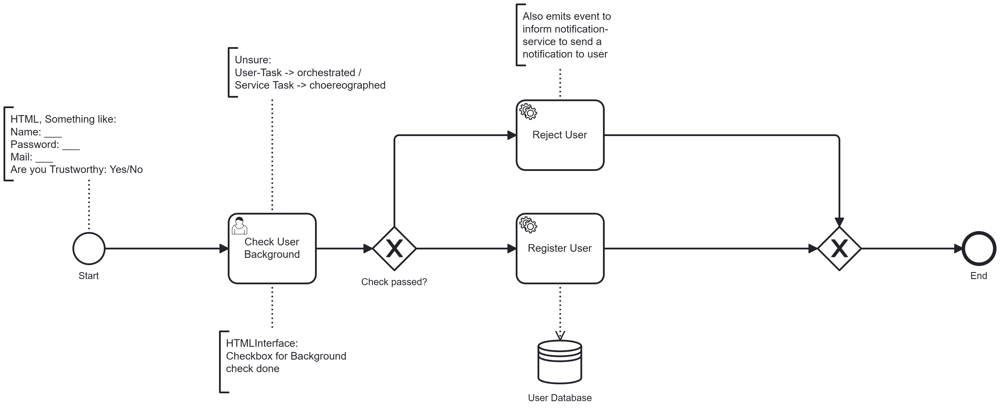
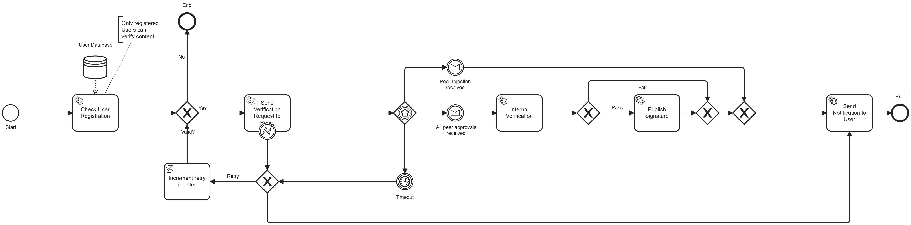
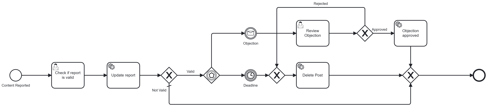
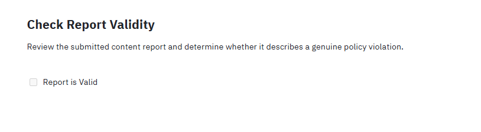
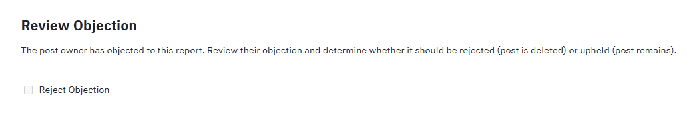

# Appendix D - BPMN Models and Forms

- Course: Event-driven and Process-oriented Architectures (EDPO), FS2026, University of St.Gallen
- Group 4
  - Evan Martino
  - Marco Birchler
  - Roman Babukh

This document provides visual representations of the executable BPMN processes and their associated Camunda forms used in the project.

---

## 1. RegisterUser Process

### 1.1 Verify User Form

---

## 2. VerifyContent Process

---

## 3. ReportContent Process

### 3.1 Check Report Validity Form

### 3.2 Review Objection Form

