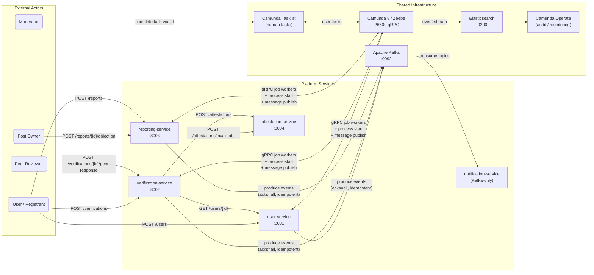
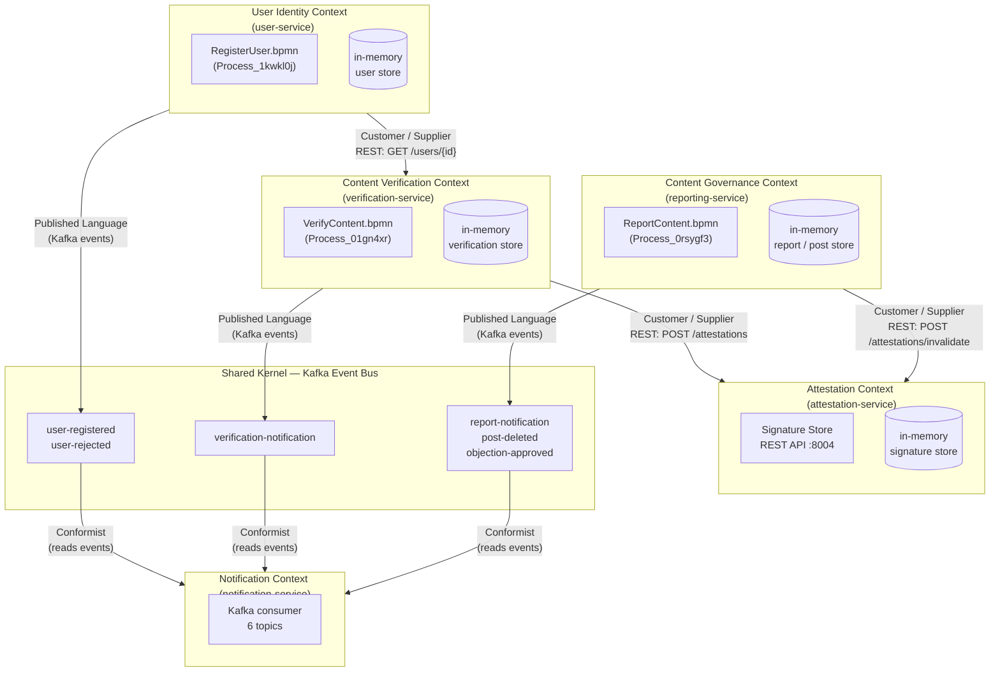
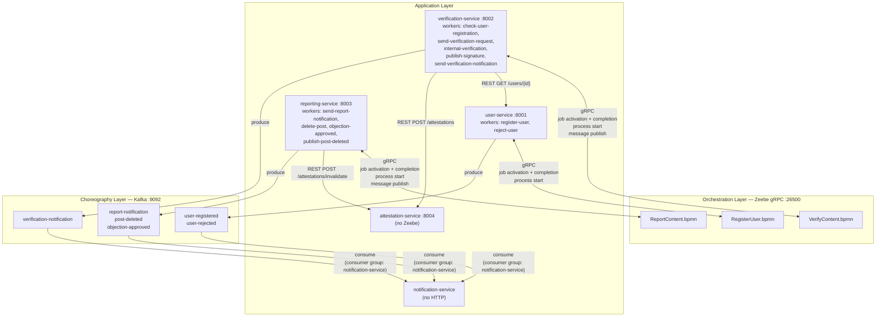
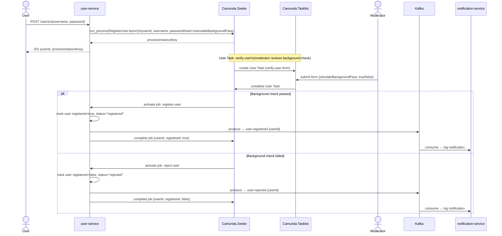
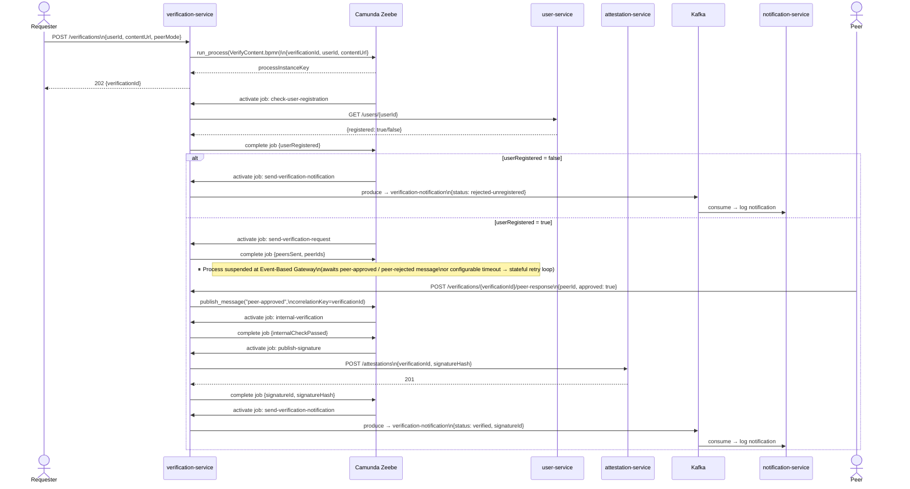
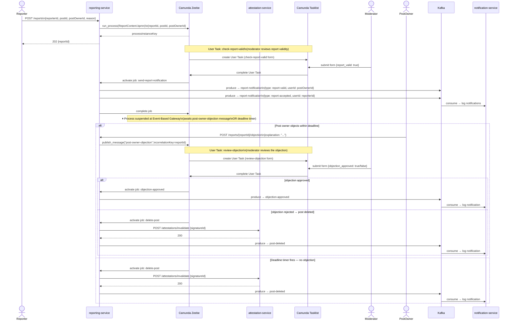

# Architecture Diagrams — EDPO Group 4 Content Verification Platform

- Course: Event-driven and Process-oriented Architectures (EDPO), FS2026, University of St.Gallen
- Group 4
  - Evan Martino
  - Marco Birchler
  - Roman Babukh

This document provides a set of conceptual-level diagrams covering the full implementation. The diagrams progress from the broad system view down to specific interaction patterns. Each is followed by a short explanation of what it shows and why it matters for the architecture.

---

## 1. System Context

The highest-level view: who interacts with the platform and through which channel. External actors on the left; platform services in the middle; shared infrastructure on the right.

**Reading notes:** All three orchestrated services (`user-service`, `verification-service`, `reporting-service`) maintain a bidirectional gRPC connection to Zeebe — they start processes, activate jobs, complete jobs, and publish messages over the same connection. The `attestation-service` is the only service with no Zeebe involvement; it is purely a REST-based signature store. The `notification-service` has no HTTP interface at all and only ever reads from Kafka.

---

## 2. Context Map (DDD)

The platform has four bounded contexts. This diagram shows their boundaries and the type of relationship between them, using standard DDD notation.

**Reading notes:** The `User Identity` context is upstream of `Content Verification` — verifications depend on it to check eligibility, but the user service has no knowledge of verifications. The `Attestation` context is a shared capability used by both `Content Verification` (to store signatures) and `Content Governance` (to invalidate them), but it has no dependency on either. Kafka serves as a shared event bus for loosely coupled notifications following a Published Language pattern; the `notification-service` is a conformist consumer that adapts to whatever events the producing contexts emit.

---

## 3. Service Architecture and Communication Channels

This diagram makes the three different communication channels explicit: Zeebe gRPC (orchestration), synchronous REST (service-to-service calls), and Kafka (choreography).

**Reading notes:** Each service owns exactly the job types declared in its own BPMN model; there is no cross-service worker. The gRPC connection carries four distinct interaction types: job polling (`ZeebeWorker`), job completion, process instance launch (`ZeebeClient.run_process`), and message publication (`ZeebeClient.publish_message`). REST calls are used only for point-to-point queries where a synchronous answer is needed within a job handler — they are never used across process boundaries for coordination.

---

## 4. RegisterUser — Sequence

The user onboarding flow. Background verification is modelled as a human task in Tasklist, making the approval decision explicit, auditable, and not automated away.

**Reading notes:** The `simulateBackgroundPass` flag lets us drive both paths in tests without requiring a real background-check integration. In production this would be replaced by a genuine third-party check result. The `userId` generated at process start is the stable identifier used in all downstream flows — it is the correlation between the identity context and the verification context.

---

## 5. VerifyContent — End-to-End Sequence

The full lifecycle of a content verification, from API call to Kafka notification. This is the most complex flow and demonstrates orchestration, message correlation, service-to-service REST, and Kafka choreography in a single trace.

**Reading notes:** The process instance is suspended at the Event-Based Gateway waiting for a peer message or a timeout. During that suspension, zero CPU or memory is consumed by the application — the state lives entirely in Zeebe's event-sourced log. The `verificationId` UUID is both the client-facing identifier (used in the REST URL) and the Zeebe correlation key, which eliminates any secondary routing table.

---

## 6. ReportContent — Human Intervention Sequence

The reporting flow demonstrates the human-in-the-loop pattern. A moderator's User Task gates the objection window, and a post owner's REST callback correlates back to the suspended instance.

**Reading notes:** There are two distinct human tasks in this flow. The first (`check-report-valid`) is always required — no automation replaces the moderator's initial judgement. The second (`review-objection`) is conditional: it only fires if the post owner submits an objection within the deadline. Both User Tasks are visible in Camunda Tasklist with rendered forms, and both completions are recorded in Camunda Operate's audit history.

---

## Summary Table

| Diagram                   | Pattern / Concept                                        | ADR Reference      |
| ------------------------- | -------------------------------------------------------- | ------------------ |
| 1. System Context         | Overall platform boundary and actors                     | —                  |
| 2. Context Map            | Bounded contexts, upstream/downstream relationships      | ADR-0006           |
| 3. Service Architecture   | Communication channels: gRPC, REST, Kafka                | ADR-0001, ADR-0005 |
| 4. RegisterUser Sequence  | Human task onboarding, Kafka notification                | ADR-0003, ADR-0006 |
| 5. VerifyContent Sequence | Orchestration, message correlation, Kafka                | ADR-0007, ADR-0005 |
| 6. ReportContent Sequence | Human intervention, objection correlation, deletion saga | ADR-0003, ADR-0007 |

