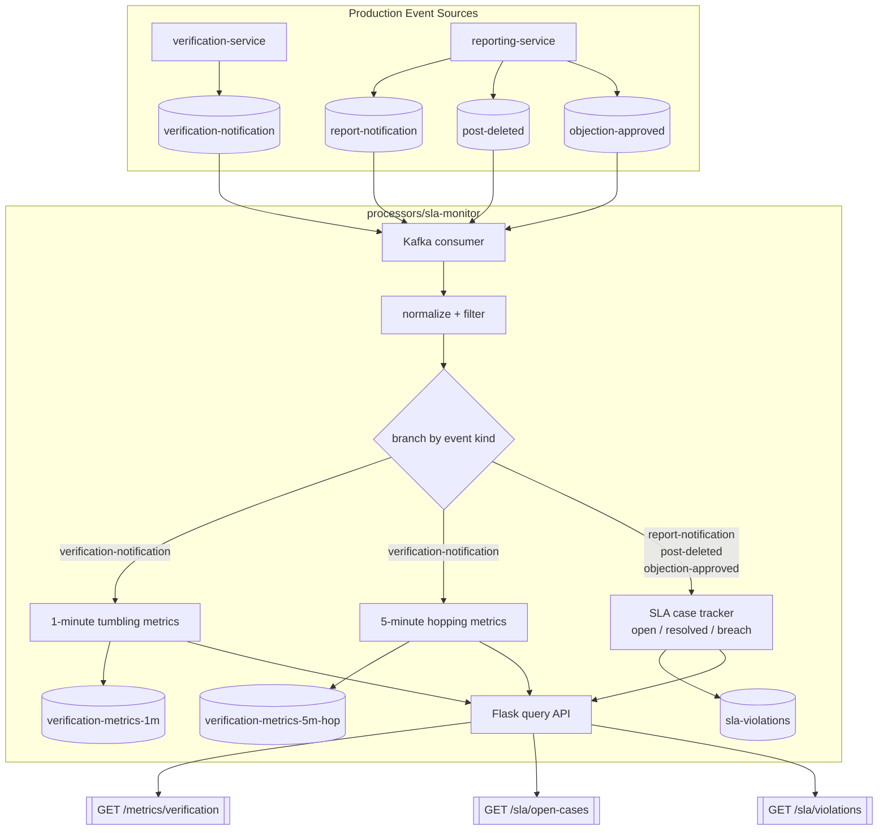

# SLA Monitor Flow

This diagram reflects the repository implementation of `processors/sla-monitor` and the
Kafka-only load-generation workaround used for stream testing.



## Interpretation

- Production path: domain services publish notification/outcome events as part of the normal
  BPMN-driven flows.
- Test path: `scripts/load_sla_monitor.py` bypasses Camunda user-task bottlenecks and writes
  directly to the same Kafka topics.
- Processor path: `sla-monitor` consumes the shared event log, computes windowed verification
  metrics, tracks report SLA state, emits breach alerts, and exposes query endpoints over its
  in-memory materialised state.

## SLA Correlation Logic

The SLA logic correlates three event types by `contentId`:

- `report-notification` with `status=report-accepted` starts an SLA case.
- `post-deleted` closes the case with a positive moderation outcome.
- `objection-approved` also closes the case with a positive moderation outcome.

Decision rule:

```text
report-accepted exists
+ no matching post-deleted / objection-approved exists yet
+ case age > SLA_SECONDS
= emit sla-violations
```

In implementation terms:

- Accepted reports are stored in `_open_sla_cases`.
- Outcome events are matched against those open cases by `contentId`.
- If an outcome arrives before the accepted-report event, it is kept temporarily in
  `_recent_sla_outcomes` so the processor can still correlate out-of-order events.
- A background scan periodically checks open cases and emits `sla-violations` once the SLA
  deadline has been exceeded without a matching closing event.

## Lecture Terms

- **Single-Event Processing**: each Kafka message is normalized and filtered before entering the
  metrics or SLA path.
- **Branch Pattern**: verification events are routed to windowed metrics; moderation events are
  routed to SLA tracking.
- **Repartitioning by Key (conceptually)**: correlation happens by `contentId`. In Kafka Streams
  this would normally require re-keying with `selectKey(contentId)`.
- **Stream-Stream Join (conceptually)**: `report-accepted` is the start stream and
  `post-deleted` / `objection-approved` form the outcome stream. The current Python code
  implements this as a manual stateful join.
- **State Store / Materialized State**: `_open_sla_cases`, `_recent_sla_outcomes`, and
  `_sla_violations` act as local materialized state.
- **Event Time vs Processing Time**: the processor uses `eventTime` from the payload for window
  placement and SLA age calculation.
- **Out-of-Order Event Handling**: temporary storage of unmatched outcomes allows later
  correlation when start and end events arrive in reverse order.
- **Interactive Queries**: `/sla/open-cases` and `/sla/violations` expose the current processor
  state directly.
