# Proposal P1 – Verification Activity Monitor & SLA Tracker

## Goal

Provide real-time observability into the verification and moderation pipeline: How many
verifications succeed or fail per time unit? Are moderation outcomes delivered within an
acceptable SLA window (e.g. a report that was accepted should result in a deletion or approved
objection within 72 hours)? Alert when SLA thresholds are breached.

This addresses the **Observability** and **Auditability** -ilities of the platform and gives
operators a live health view without any bespoke audit database.

---

## Input Streams

| Topic | Role |
|---|---|
| `verification-notification` | Primary signal (verified / peer-rejected / rejected-unregistered) |
| `report-notification` | Report accepted/valid events (start of moderation SLA clock) |
| `post-deleted` | Positive moderation outcome |
| `objection-approved` | Positive moderation outcome (overruled) |

---

## Output

| Output | Type | Description |
|---|---|---|
| `sla-violations` | Kafka topic | Alert event when a moderation case exceeds the SLA window |
| `verification-metrics-1m` | Kafka topic | Tumbling-window aggregates (counts + rates) per minute |
| `verification-metrics-5m-hop` | Kafka topic | Hopping-window aggregates for trend smoothing |
| `metricsStore` | State store (KV + Window) | Queryable via interactive queries |
| REST `/metrics/verification` | Interactive Query endpoint | Current and windowed counts by status |
| REST `/sla/violations` | Interactive Query endpoint | Open SLA breaches |

---

## Stream Processing Topology

> **Rendering note**: Mermaid diagrams render natively on GitHub and in VS Code's built-in Markdown Preview (View → Open Preview). No plugin required for VS Code ≥ 1.77.

```mermaid
flowchart TD
    subgraph ST1["Sub-topology 1 · Verification Metrics"]
        VN[(verification-notification)]
        VN --> F1[filter\nby status]
        F1 --> MV1[mapValues\nnormalize + eventTime]
        MV1 --> BR1{branch}
        BR1 -->|verified| SK1[selectKey\nplatformKey]
        BR1 -->|peer-rejected| SK1
        BR1 -->|rejected-unregistered| SK1
        SK1 --> GBK1[groupByKey]
        GBK1 --> TW1[windowedBy\ntumbling · 1 min]
        GBK1 --> TW2[windowedBy\nhopping · 5 min / 1 min]
        TW1 --> AGG1[aggregate · count per status]
        TW2 --> AGG2[aggregate · count per status]
        AGG1 --> SUP[suppress\nemit on window close]
        SUP --> MS[(metricsStore)]
        SUP --> T1[(verification-metrics-1m)]
        MS -.->|Interactive Query| IQ1[[REST /metrics/verification]]
    end

    subgraph ST2["Sub-topology 2 · SLA Tracking"]
        RN[(report-notification)]
        PD[(post-deleted)]
        OA[(objection-approved)]
        RN --> F2[filter\ntype = report-accepted]
        F2 --> SK2[selectKey · contentId]
        PD --> SK3[selectKey · contentId]
        OA --> SK4[selectKey · contentId]
        SK3 & SK4 --> MRG[merge · outcomes]
        SK2 --> JOIN[KStream–KStream join\nJoinWindows · 72 h · event-time]
        MRG --> JOIN
        JOIN --> MV2[mapValues\ncompute durationMs]
        MV2 --> BR2{branch}
        BR2 -->|within SLA| DISC([discard])
        BR2 -->|SLA breach| SV[(sla-violations)]
        SV -.->|Interactive Query| IQ2[[REST /sla/violations]]
    end
```

**Key topology decisions:**
- `filter` and `mapValues` are **stateless** operations (Week 8 – Single-Event Processing).
- `branch` demonstrates the **Branch pattern** (Week 8).
- `selectKey` performs **repartitioning** so that events with the same contentId land on the
  same partition for the join (Week 8 – Multiphase Processing / Repartitioning).
- **KStream-KStream windowed join** correlates report-accepted with its eventual outcome
  (Week 8/9 – Streaming Join).
- **windowedBy + aggregate + suppress** implement tumbling and hopping windows with
  correct event-time semantics and grace periods (Week 10 – Windowed Operations).
- **Interactive Queries** on `metricsStore` expose current state without consuming output
  topics (Week 9 – Interactive Queries).

---

## Lecture Concepts Covered

| Concept | Week | How it is used |
|---|---|---|
| Single-Event Processing (map/filter) | 8 | Normalize and filter events by status |
| Branch pattern | 8 | Route by verification status |
| Repartitioning / selectKey | 8 | Co-locate by contentId for join |
| Streaming Join (windowed) | 8/9 | Join report-accepted with its outcome |
| State Stores | 9 | metricsStore backed by RocksDB changelog |
| Interactive Queries | 9 | REST endpoint reads directly from state stores |
| Tumbling Windows | 10 | 1-minute operational metrics |
| Hopping Windows | 10 | 5-minute/1-minute trend view |
| Event Time vs Processing Time | 10 | Use embedded `eventTime` in payload |
| Grace Period | 10 | Allow late-arriving outcome events |
| Suppress | 10 | Only emit final result at window close |

---

## -ilities Supported

- **Observability**: Live verification throughput and outcome distribution visible in real time.
- **Auditability**: SLA violations are persisted as events (replay possible).
- **Availability**: Monitor runs as an independent service; failures do not affect core BPMN flows.
- **Resilience**: State store backed by Kafka changelog; recovers from restart without data loss.

---

## Bundling Recommendations

This proposal works well on its own but is most powerful when combined with:
- **P3 – Abuse & Anomaly Detector**: Together they cover the full "monitoring + alerting" story.
- **P6 – Audit Explainability Index**: SLA violation events can be enriched with user/content context.
- **P7 – Platform Activity Dashboard**: Share the `metricsStore` or its output topics as a dashboard feed.

A minimal viable bundle covering all assignment requirements: **P1 + P2 + P6**.

---

## Implementation Hint

New Java service `sla-monitor-service` with:
- Kafka Streams topology as described.
- Embedded HTTP server (Javalin, Spring Boot, or Ktor) exposing interactive query REST endpoints.
- Added to `docker-compose.yml`.
- Avro schemas in `schemas/sla-monitor/` (or JSON for simplicity).

Existing services need: `eventTime` added to all event payloads (one-line change per service).
`contentId` added to `report-notification` and `post-deleted` payloads.
